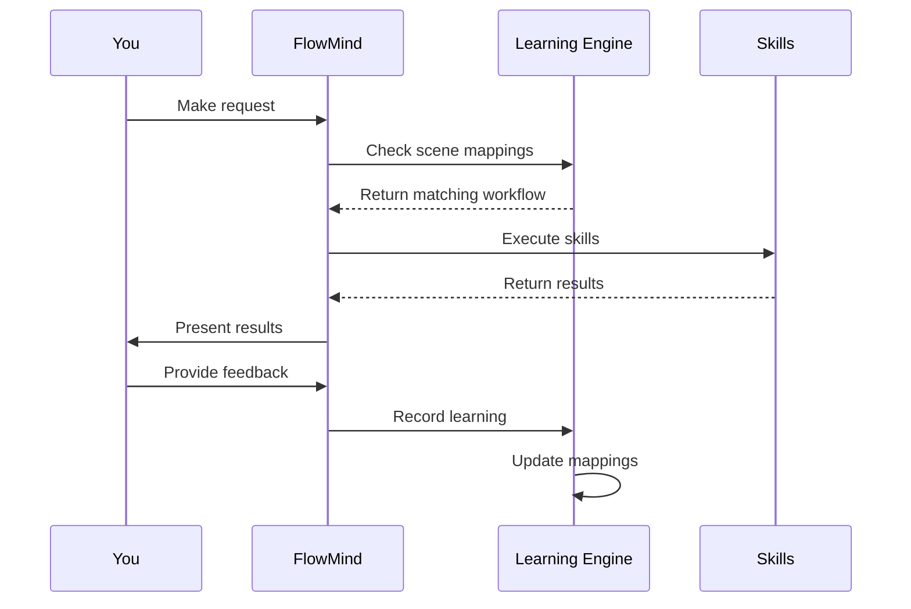

<div align="center">

# 🧠 FlowMind

### **The AI Agent That Learns How You Work**

*Stop repeating yourself. FlowMind learns your workflows and applies them automatically.*

[](LICENSE)
[](CONTRIBUTING.md)
[](CHANGELOG.md)

**English** | [中文](README_CN.md)

[Quick Start](#-quick-start) • [How It Works](#-how-it-works) • [Use Cases](#-use-cases) • [Architecture](#-architecture) • [Roadmap](#-roadmap)

</div>

---

## 🎯 The Problem

Developers waste **20-30% of their time** repeating the same instructions to AI tools:

```
❌ Every single time:
"Format output as table..."
"Use sequential list..."
"Check errors first then..."
"Connect using source_id..."
```

## 💡 The Solution

**FlowMind learns once, applies forever.**

```
✅ First time: You teach FlowMind
✅ Every time after: FlowMind remembers
```

---

## 🚀 Quick Start

### Installation

```bash
npm install -g flowmind
```

### Initialize

```bash
flowmind init
```

### Start Using

```bash
# First time - teach FlowMind your preference
flowmind "查询 traceId 日志，用顺序列表格式"
FlowMind: [Executes and learns your preference]

# Next time - FlowMind remembers!
flowmind "查询 traceId abc123 的日志"
FlowMind: [Automatically uses sequential list format] ✓
```

---

## 🧠 How It Works

### 1. Learning from Corrections


**Example:**
```
You: "查询日志"
FlowMind: [Returns tree format]
You: "不对，用顺序列表"
FlowMind: [Records preference]

You: [Next time] "查询日志"
FlowMind: [Uses sequential list automatically] ✓
```

### 2. Scene Mapping

Map specific request patterns to workflows:

```
You: "查询线上日志用 SLS 技能，格式用顺序列表"
FlowMind: [Records scene mapping]

You: [Any time] "查询线上日志..."
FlowMind: [Auto-applies your workflow] ✓
```

### 3. Skill System

Modular skills for different tasks:

| Skill | What It Does |
|-------|--------------|
| 🔍 **Log Audit** | Log analysis, trace visualization |
| 🔌 **Resource Bind** | Database, Redis, API connections |
| 📝 **Code Review** | Code quality, security checks |
| ✅ **Data Validation** | Business logic verification |
| 📚 **API Sync** | Documentation synchronization |

---

## 📊 Use Cases

### 1. Automated Log Analysis

```bash
# Teach once
flowmind "查询 traceId 日志用顺序列表，显示 URL、入参、响应"

# Use forever
flowmind "查询 traceId abc123"
# → Automatically uses your preferred format
```

### 2. Consistent Code Review

```bash
# Set your standards
flowmind "代码审查先检查安全漏洞，再检查代码质量"

# Every review follows your order
flowmind "审查这个 PR"
# → Security first, then quality
```

### 3. Streamlined Debugging

```bash
# Define your workflow
flowmind "排查问题先查错误日志，再查链路，最后查代码"

# Consistent debugging every time
flowmind "排查线上问题 xxx"
# → Follows your defined workflow
```

---

## 🏗️ Architecture

```
flowmind/
├── core/                      # Core engine
│   ├── agent.js              # Main agent logic
│   ├── learning.js           # Learning engine
│   └── matcher.js            # Scene matching
├── skills/                    # Skill modules
│   ├── log-audit/           # Log analysis
│   ├── resource-bind/       # Resource management
│   ├── code-review/         # Code review
│   └── learning-engine/     # Learning system
├── learning/                  # Learning storage
│   ├── records/             # Learning records
│   └── scenes.json          # Scene mappings
└── templates/                # Output templates
```

### Learning Flow



---

## 📈 Impact & Metrics

| Metric | Before FlowMind | After FlowMind |
|--------|-----------------|----------------|
| Repetitive instructions | 100% | ~5% |
| Workflow consistency | Variable | 98%+ |
| Debugging time | 30 min | 10 min |
| Onboarding new devs | 2 weeks | 2 days |

---

## ✨ Features

### 🏗️ Core Architecture

FlowMind is built on **enterprise-grade architecture design standards**, incorporating extensive experience from architects and senior developers:

- 📐 **OpenSpec Design Standards** - Standardized skill definitions and interface specifications
- 🧠 **RAG Business Logic** - Intelligent retrieval and generation based on historical data
- 💾 **Data Persistence** - All learning records and configurations stored locally
- ⚙️ **Global Config Initialization** - One-time setup, permanent effect, no repeated configuration

### 🔌 MCP Integration Ecosystem

FlowMind deeply integrates mainstream development platforms for a **one-stop development workflow**:

| Platform | Integration Capabilities |
|----------|--------------------------|
| 📖 **Yuque** | Design doc sync, knowledge base management, OpenSpec archiving |
| 📊 **Alibaba Cloud SLS** | Real-time log query, TraceID tracing, anomaly detection & analysis |
| 🗄️ **Alibaba Cloud RDS** | Database connection, data reading & validation, SQL execution analysis |
| 📋 **YApi** | API doc sync, interface testing, Swagger import/export |
| 🐙 **GitHub** | Code repo management, PR review, Issue tracking, auto-archiving |

### 🚀 One-Stop Problem Solving Flow

```
Code Locate → Data Verify → Problem Analyze → One-Click Fix → Auto Deploy → Archive
    ↓              ↓              ↓               ↓              ↓            ↓
Local+MCP      RDS Read      SLS Analysis    Code Modify    Pipeline     OpenSpec+Yuque
```

**Core Advantages:**
- 🔍 **Multi-Source Code Location** - Local code + MCP remote + SSH mode, auto read and locate
- 📊 **Real Data Validation** - Direct RDS connection for real data, verify business logic
- 🎯 **Precise Problem Analysis** - SLS intelligent log analysis, quick root cause identification
- ⚡ **One-Click Fix & Deploy** - From problem discovery to fix deployment, fully automated
- 📝 **Auto Archiving** - OpenSpec design standards + Yuque docs, automatic archiving
- 🧠 **RAG Data Building** - Auto-generate RAG training data, continuously optimize intelligence

### 🎯 Smarter with Every Use

- 📈 **Learning Accumulation** - Every use accumulates experience, understands your code and thinking better
- 🔄 **Scene Coordination** - Skills auto-coordinate across different scenarios, forming complete workflows
- 💰 **Token Optimization** - Reduce token consumption through mapping files, lower AI costs
- ⏱️ **Efficiency Boost** - Reduce repetitive waiting, 10x efficiency through automation
- 🎓 **Experience Retention** - Architect and senior developer design thinking, permanently preserved

### 🔧 Skill System (11 Core Skills)

#### 📊 Analysis Skills

| Skill | Description |
|-------|-------------|
| 🔍 **log-audit** | Log Audit - Time filtering, service filtering, level filtering, keyword search, TraceID tracing, performance analysis |
| 🔎 **project-review** | Project Review - Dependency analysis, security audit, license compliance, code complexity, test coverage, technical debt assessment |
| 📋 **git-review** | Git Review - Commit quality analysis, change size assessment, impact analysis, risk evaluation, dependency change detection |

#### 🔌 Integration Skills

| Skill | Description |
|-------|-------------|
| 🔗 **resource-bind** | Resource Bind - MySQL/PostgreSQL connection management, Redis operations, REST API integration, authentication management |
| 📚 **api-sync** | API Sync - Generate docs from code annotations, OpenAPI/Swagger spec generation, client SDK generation, version management |
| ✅ **data-validation** | Data Validation - Referential integrity checks, data type validation, business logic verification, state machine validation, duplicate detection |

#### 🛠️ Quality Skills

| Skill | Description |
|-------|-------------|
| 🔒 **code-review** | Code Review - SQL injection detection, XSS vulnerability scanning, authentication issues, code style, complexity analysis, design pattern checks |
| 📝 **archive-change** | Archive Change - Archive completed changes, auto-generate change summary, update changelog, create knowledge base entries, link Issue/PR |

#### ⚡ Automation Skills

| Skill | Description |
|-------|-------------|
| 🔄 **auto-flow** | Auto Flow - Sequential execution, parallel execution, conditional branching, error handling, workflow templates, team sharing |

#### 🧠 Intelligence Skills

| Skill | Description |
|-------|-------------|
| 🎯 **learning-engine** | Learning Engine - Correction learning, scene learning, preference learning, auto-application, learning loop, knowledge graph construction |

### 🎯 Core Capabilities Explained

#### 1️⃣ OpenSpec Design Standards
```
Standardized skill definitions → Unified interface specifications → Plug and play
```
- Each skill has a standard SKILL.md definition file
- Unified trigger conditions, feature descriptions, and examples
- Support for custom skill extensions

#### 2️⃣ RAG Business Logic
```
Historical data collection → Intelligent retrieval matching → Context generation → Auto application
```
- Intelligent matching based on historical learning records
- Scene similarity calculation and recommendations
- Context-aware workflow application

#### 3️⃣ Data Persistence
```
Learning records → Local storage → Permanent retention → Cross-session reuse
```
- All learning records stored locally and persistently
- Configuration information permanently retained
- Support import/export for team sharing

#### 4️⃣ Global Config Initialization
```
flowmind init → One-time configuration → Permanent effect
```
- Run `flowmind init` to complete initialization
- Configure resource connections, learning preferences, output formats
- No need to repeat setup each time

#### 5️⃣ Learning Feedback Mechanism (Self-Evolution)
```
User correction → Record learning → Auto apply → Continuous optimization
```
- **Correction Learning**: "No, use table format" → Auto-remembered
- **Scene Learning**: "Check errors first then traces" → Workflow recorded
- **Preference Learning**: "Reply in Chinese" → Language preference saved
- **Auto Application**: Automatically uses learned workflows next time

---

## 🌟 Community Building

**FlowMind's Core Philosophy: More Users, Smarter Together!**

### Why We Need You?

```
Everyone's work habits → Combined into intelligent knowledge base
Your every use → Makes FlowMind understand developers better
Your every correction → Helps everyone improve efficiency
```

### How to Participate?

1. **Use & Feedback** - Use FlowMind daily, tell us what can be better
2. **Share Workflows** - Share your workflows with team and community
3. **Contribute Code** - Add skills, improve algorithms, optimize experience
4. **Spread the Word** - Let more developers know about FlowMind

### Benefits of Participation

- 🚀 **Personal Efficiency** - Let FlowMind handle repetitive work
- 🧠 **Collective Wisdom** - Combine experiences from millions of developers
- 🌍 **Open Source Sharing** - All learning成果 shared openly
- 🤝 **Community Recognition** - Contributors permanently recorded

**Let's build smarter developer tools together!**

---

## 🤝 Contributing

We welcome contributions! See [CONTRIBUTING.md](CONTRIBUTING.md) for details.

### Ways to Contribute
- 🐛 Report bugs
- 💡 Suggest features
- 📝 Improve docs
- 🛠️ Add skills
- 🌍 Translations
- 🧪 Write tests

---

## 📄 License

MIT License - see [LICENSE](LICENSE) for details.

---

## 🙏 Acknowledgments

Built with:
- Claude AI - Intelligence backbone
- Open source community - Inspiration and support

---

## 📞 Contact

- **GitHub**: [github.com/Eleven-M/flowmind](https://github.com/Eleven-M/flowmind)
- **Email**: 13060993305@163.com

---

<div align="center">

**[⬆ back to top](#flowmind)**

Made with ❤️ by the FlowMind team

*"Learn once, flow forever"*

</div>