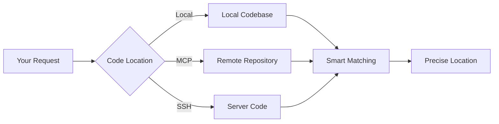
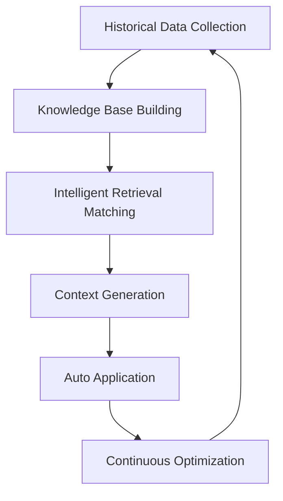
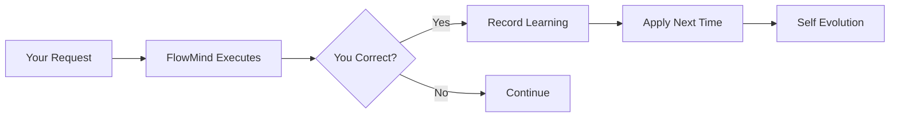
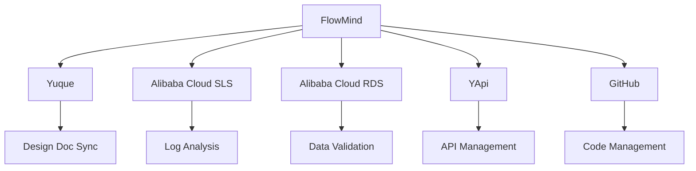
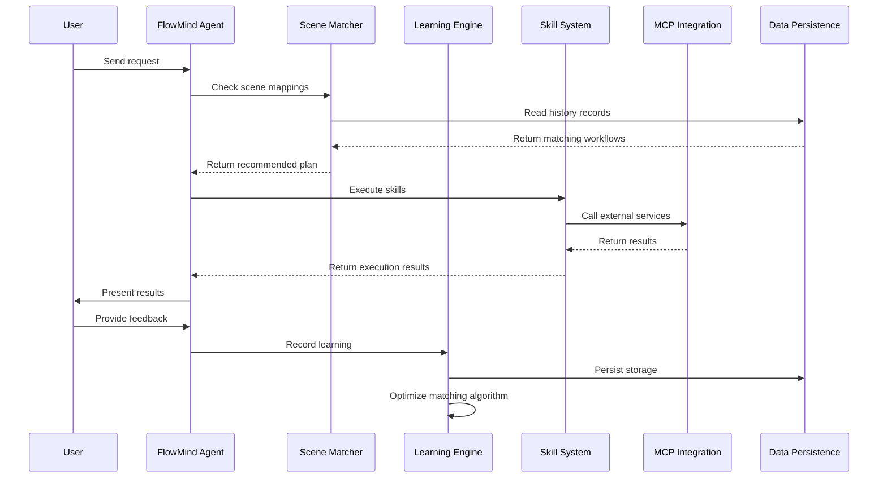
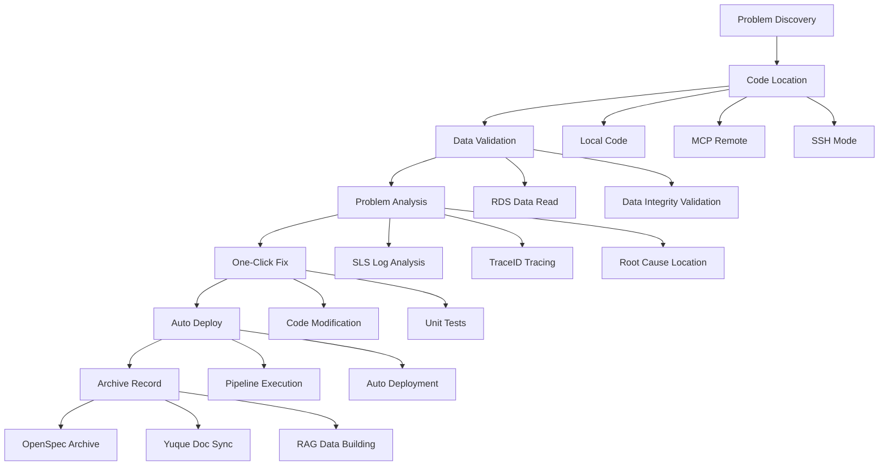

<div align="center">

# 🧠 FlowMind

### **Your AI Mentor for Code, Career & Beyond**

*Stop repeating yourself. FlowMind learns your workflows, understands your projects, and guides your growth.*

[](LICENSE)
[](CONTRIBUTING.md)
[](CHANGELOG.md)

[中文](README_CN.md) | [Quick Start](#-quick-start) | [How It Works](#-how-it-works) | [Use Cases](#-use-cases) | [Architecture](#-architecture)

</div>

---

## 🎯 The Problem

Whether you're a developer, architect, product manager, or tech lead, you face these challenges:

### 1. Repetitive Labor
```
❌ Same instructions every single time:
"Format output as table..."
"Use sequential list..."
"Check errors first then..."
"Connect using source_id..."
```

### 2. Scattered Tools
```
❌ Constantly switching between platforms:
SLS for logs → RDS for data → Code repo → YApi for APIs → Yuque for docs
```

### 3. Lost Experience
```
❌ Valuable experience cannot be preserved:
Architect's design thinking → Lost with project end
Debugging paths → Have to摸索 again next time
Best practices → Cannot be reused or传承
```

### 4. Low Efficiency
```
❌ Repetitive waiting and inefficient operations:
Configure database connection every time
Enter complete conditions for every log query
Manually execute multiple steps for each deployment
```

### 5. Lack of Mentorship
```
❌ No one to guide your growth:
Join a new project → Spend weeks understanding the codebase
Make technical decisions → No experienced mentor to consult
Career development → No personalized guidance
Architecture design → Learn only from mistakes
```

---

## 💡 The Solution

**FlowMind learns once, applies forever.**

### Core Philosophy

```
✅ First time: You teach FlowMind
✅ Every time after: FlowMind remembers
✅ Smarter with use: AI self-evolution
```

### One-Stop Solution

```
Code Locate → Data Verify → Problem Analyze → One-Click Fix → Auto Deploy → Archive
    ↓              ↓              ↓               ↓              ↓            ↓
Local+MCP      RDS Read      SLS Analysis    Code Modify    Pipeline     OpenSpec+Yuque
```

### Your AI Mentor

```
🎓 Project Onboarding    → Understand codebase in hours, not weeks
🧭 Technical Guidance    → Architecture advice based on your context
📈 Career Growth         → Personalized learning paths and skill development
💡 Decision Support      → Data-driven insights for technical choices
🔍 Code Understanding    → Deep dive into any codebase with expert explanations
```

### Smarter with Every Use

- 🧠 **Learning Accumulation** - Every use accumulates experience, understands your code and thinking better
- 🔄 **Scene Coordination** - Skills auto-coordinate across different scenarios, forming complete workflows
- 💰 **Token Optimization** - Reduce token consumption through mapping files, lower AI costs
- ⏱️ **Efficiency Boost** - Reduce repetitive waiting, 10x efficiency through automation
- 🎓 **Experience Retention** - Architect and senior developer design thinking, permanently preserved

---

## 🚀 Quick Start

### Installation

```bash
npm install -g flowmind
```

### Initialize

```bash
flowmind init
```

> One-time configuration, permanent effect. Configure resource connections, learning preferences, output formats - no need to repeat setup.

### Start Using

```bash
# First time - teach FlowMind your preference
flowmind "查询 traceId 日志，用顺序列表格式"
FlowMind: [Executes and learns your preference]

# Next time - FlowMind remembers!
flowmind "查询 traceId abc123 的日志"
FlowMind: [Automatically uses sequential list format] ✓
```

---

## 🧠 How It Works

### 1. Multi-Source Code Location



**Supported Modes:**
- 📁 **Local Mode** - Directly read local codebase
- 🔌 **MCP Mode** - Connect remote repositories via MCP protocol
- 🔐 **SSH Mode** - SSH connection to read server code

### 2. RAG Intelligent Retrieval



**RAG Process:**
- 📚 **Data Collection** - Collect historical learning records, workflows, best practices
- 🔍 **Smart Matching** - Based on scene similarity calculation, recommend best matching workflows
- 📝 **Context Generation** - Auto-generate context, reduce repetitive input
- 🔄 **Continuous Optimization** - Every use optimizes matching algorithms

### 3. Learning Feedback Mechanism



**Learning Types:**
- 📚 **Correction Learning** - "No, use table format" → Auto-remembered
- 🗺️ **Scene Learning** - "Check errors first then traces" → Workflow recorded
- ⚙️ **Preference Learning** - "Reply in Chinese" → Language preference saved
- 🔄 **Auto Application** - Automatically uses learned workflows next time

### 4. MCP Integration Ecosystem



**Integration Capabilities:**

| Platform | Integration Capabilities |
|----------|--------------------------|
| 📖 **Yuque** | Design doc sync, knowledge base management, OpenSpec archiving |
| 📊 **Alibaba Cloud SLS** | Real-time log query, TraceID tracing, anomaly detection & analysis |
| 🗄️ **Alibaba Cloud RDS** | Database connection, data reading & validation, SQL execution analysis |
| 📋 **YApi** | API doc sync, interface testing, Swagger import/export |
| 🐙 **GitHub** | Code repo management, PR review, Issue tracking, auto-archiving |

---

## 📊 Use Cases

### Scenario 1: Online Problem Investigation

```bash
# Traditional way (10+ steps):
1. Login to SLS console
2. Enter query conditions
3. Find traceId
4. Copy traceId
5. Search traces
6. Locate error
7. Connect RDS
8. Query data
9. Analyze cause
10. Modify code
11. Submit deployment
12. Write documentation

# FlowMind way (1 command):
flowmind "排查线上问题 traceId abc123"
# → Auto complete: SLS query → Trace tracking → RDS data validation → Code location → Fix suggestion
```

### Scenario 2: Code Review

```bash
# Set your standards (only once)
flowmind "代码审查先检查安全漏洞，再检查代码质量，最后检查性能"

# Every review follows your standards
flowmind "审查这个 PR"
# → Security first → Quality check → Performance analysis
```

### Scenario 3: API Documentation Sync

```bash
# Generate docs from code
flowmind "从代码注释生成 API 文档"

# Sync to YApi
flowmind "同步接口到 YApi"

# Auto update Yuque
flowmind "同步 API 文档到语雀"
```

### Scenario 4: Data Validation

```bash
# Connect RDS to validate data
flowmind "验证订单表数据完整性"

# Auto execute checks
# → Referential integrity → Data types → Business logic → State machine
```

### Scenario 5: Project Health Check

```bash
# Full review
flowmind "审查项目整体状况"

# Auto execute:
# → Dependency analysis → Security audit → Code complexity → Test coverage → Technical debt
```

### Scenario 6: Project Onboarding (As Your Mentor)

```bash
# New to a project? FlowMind guides you
flowmind "帮我理解这个项目的整体架构"

# Auto execute:
# → Project structure analysis → Core module explanation → Data flow mapping
# → Key design decisions → Development guidelines → Suggested learning path
```

### Scenario 7: Technical Decision Support

```bash
# Facing a technical choice? Ask your mentor
flowmind "这个功能应该用 Redis 还是 MongoDB？"

# FlowMind analyzes:
# → Your project context → Current tech stack → Performance requirements
# → Team expertise → Maintenance cost → Provides data-driven recommendation
```

### Scenario 8: Career Growth Guidance

```bash
# Want to improve? FlowMind guides your growth
flowmind "分析我的代码风格，给出改进建议"

# FlowMind provides:
# → Code pattern analysis → Best practice comparison → Skill gap identification
# → Personalized learning resources → Practice exercises → Progress tracking
```

---

## 🏗️ Architecture

### System Architecture

```
┌─────────────────────────────────────────────────────────────┐
│                      FlowMind Agent                        │
├─────────────────────────────────────────────────────────────┤
│  ┌──────────────┐  ┌──────────────┐  ┌──────────────┐    │
│  │ Scene Matcher│  │Learning Engine│  │ Skill Loader │    │
│  └──────────────┘  └──────────────┘  └──────────────┘    │
├─────────────────────────────────────────────────────────────┤
│  ┌─────────────────────────────────────────────────────┐  │
│  │                   Skill System                       │  │
│  ├─────────────┬─────────────┬─────────────┬───────────┤  │
│  │ Analysis    │ Integration │ Quality     │Automation │  │
│  └─────────────┴─────────────┴─────────────┴───────────┘  │
├─────────────────────────────────────────────────────────────┤
│  ┌─────────────────────────────────────────────────────┐  │
│  │                 MCP Integration Layer                │  │
│  ├─────────┬─────────┬─────────┬─────────┬─────────────┤  │
│  │  Yuque  │   SLS   │   RDS   │   YApi  │   GitHub   │  │
│  └─────────┴─────────┴─────────┴─────────┴─────────────┘  │
├─────────────────────────────────────────────────────────────┤
│  ┌─────────────────────────────────────────────────────┐  │
│  │                  Data Persistence Layer              │  │
│  ├─────────────┬─────────────┬─────────────────────────┤  │
│  │Learning     │Scene        │Configuration            │  │
│  │Records      │Mappings     │Info                     │  │
│  └─────────────┴─────────────┴─────────────────────────┘  │
└─────────────────────────────────────────────────────────────┘
```

### Directory Structure

```
flowmind/
├── core/                          # Core Engine
│   ├── index.js                  # Main entry
│   ├── learning-engine.js        # Learning engine
│   ├── scene-matcher.js          # Scene matching
│   ├── skill-loader.js           # Skill loading
│   └── config-manager.js         # Config management
├── skills/                        # Skill Modules (17 core skills)
│   ├── log-audit/                # Log audit
│   ├── sls-log-audit/            # SLS log audit (chain tracing)
│   ├── resource-bind/            # Resource binding
│   ├── code-review/              # Code review
│   ├── code-review-audit/        # Code review audit (3D review)
│   ├── data-validation/          # Data validation
│   ├── data-logic-validation/    # Data logic validation
│   ├── api-sync/                 # API sync
│   ├── yapi-sync-interface/      # YApi interface sync
│   ├── yuque-sync-design/        # Yuque design doc sync
│   ├── project-review/           # Project review
│   ├── git-review/               # Git review
│   ├── archive-change/           # Change archiving
│   ├── auto-flow/                # Workflow automation
│   ├── learning-engine/          # Learning engine
│   ├── learning-feedback/        # Learning feedback (global)
│   └── requirement-analyst/      # Requirement analyst (6D analysis)
├── learning/                      # Learning Storage
│   ├── records/                  # Learning records
│   └── scenes.json               # Scene mappings
├── templates/                     # Output templates
└── config/                        # Configuration files
```

### Learning Flow



### One-Stop Problem Solving Flow



---

## ✨ Features

### 🏗️ Core Architecture

FlowMind is built on **enterprise-grade architecture design standards**, incorporating extensive experience from architects and senior developers:

- 📐 **OpenSpec Design Standards** - Standardized skill definitions and interface specifications
- 🧠 **RAG Business Logic** - Intelligent retrieval and generation based on historical data
- 💾 **Data Persistence** - All learning records and configurations stored locally
- ⚙️ **Global Config Initialization** - One-time setup, permanent effect, no repeated configuration

### 🔧 Skill System (17 Core Skills)

#### 📊 Analysis Skills

| Skill | Description |
|-------|-------------|
| 🔍 **log-audit** | Log Audit - Time filtering, service filtering, level filtering, keyword search, TraceID tracing, performance analysis |
| 🔗 **sls-log-audit** | SLS Log Audit - Alibaba Cloud SLS log query, TraceID chain analysis, Feign call chain extraction, response time analysis |
| 🔎 **project-review** | Project Review - Dependency analysis, security audit, license compliance, code complexity, test coverage, technical debt assessment |
| 📋 **git-review** | Git Review - Commit quality analysis, change size assessment, impact analysis, risk evaluation, dependency change detection |
| 📐 **requirement-analyst** | Requirement Analyst - Historical design principles, iteration rationale, extensibility, market roadmap, req-code deviation, upgrade vulnerabilities |

#### 🔌 Integration Skills

| Skill | Description |
|-------|-------------|
| 🔗 **resource-bind** | Resource Bind - MySQL/PostgreSQL connection management, Redis operations, REST API integration, authentication management |
| 📚 **api-sync** | API Sync - Generate docs from code annotations, OpenAPI/Swagger spec generation, client SDK generation, version management |
| 📋 **yapi-sync-interface** | YApi Interface Sync - Sync Controller interfaces to YApi, Swagger import/export, interface management |
| 📖 **yuque-sync-design** | Yuque Design Sync - Sync OpenSpec design docs to Yuque, knowledge base management, document archiving |
| ✅ **data-validation** | Data Validation - Referential integrity checks, data type validation, business logic verification, state machine validation, duplicate detection |
| 🔬 **data-logic-validation** | Data Logic Validation - Verify actual SQL queries and Redis logic via MCP database/Redis connections |

#### 🛠️ Quality Skills

| Skill | Description |
|-------|-------------|
| 🔒 **code-review** | Code Review - SQL injection detection, XSS vulnerability scanning, authentication issues, code style, complexity analysis, design pattern checks |
| 🛡️ **code-review-audit** | Code Review Audit - Three-dimensional review: security audit, design compliance, mandatory constraint validation before merge/test |
| 📝 **archive-change** | Archive Change - Archive completed changes, auto-generate change summary, update changelog, create knowledge base entries, link Issue/PR |

#### ⚡ Automation Skills

| Skill | Description |
|-------|-------------|
| 🔄 **auto-flow** | Auto Flow - Sequential execution, parallel execution, conditional branching, error handling, workflow templates, team sharing |

#### 🧠 Intelligence Skills

| Skill | Description |
|-------|-------------|
| 🎯 **learning-engine** | Learning Engine - Correction learning, scene learning, preference learning, auto-application, learning loop, knowledge graph construction |
| 📝 **learning-feedback** | Learning Feedback (Global) - Capture user corrections, scene mapping, auto-bind to relevant skills, continuous optimization |

### 🎯 Core Capabilities Explained

#### 1️⃣ OpenSpec Design Standards
```
Standardized skill definitions → Unified interface specifications → Plug and play
```
- Each skill has a standard SKILL.md definition file
- Unified trigger conditions, feature descriptions, and examples
- Support for custom skill extensions

#### 2️⃣ RAG Business Logic
```
Historical data collection → Intelligent retrieval matching → Context generation → Auto application
```
- Intelligent matching based on historical learning records
- Scene similarity calculation and recommendations
- Context-aware workflow application

#### 3️⃣ Data Persistence
```
Learning records → Local storage → Permanent retention → Cross-session reuse
```
- All learning records stored locally and persistently
- Configuration information permanently retained
- Support import/export for team sharing

#### 4️⃣ Global Config Initialization
```
flowmind init → One-time configuration → Permanent effect
```
- Run `flowmind init` to complete initialization
- Configure resource connections, learning preferences, output formats
- No need to repeat setup each time

#### 5️⃣ Learning Feedback Mechanism (Self-Evolution)
```
User correction → Record learning → Auto apply → Continuous optimization
```
- **Correction Learning**: "No, use table format" → Auto-remembered
- **Scene Learning**: "Check errors first then traces" → Workflow recorded
- **Preference Learning**: "Reply in Chinese" → Language preference saved
- **Auto Application**: Automatically uses learned workflows next time

---

## 📈 Impact & Metrics

| Metric | Before FlowMind | After FlowMind |
|--------|-----------------|----------------|
| Repetitive instructions | 100% | ~5% |
| Workflow consistency | Variable | 98%+ |
| Problem investigation time | 30+ min | 5 min |
| Onboarding new devs | 2 weeks | 2 days |
| Token consumption | High | Reduce 60%+ |
| Experience retention | Cannot preserve | Permanent reuse |
| Project understanding | Weeks of reading | Hours with guidance |
| Technical decision confidence | Gut feeling | Data-driven insights |
| Code quality improvement | Slow, trial-error | Fast, mentor-guided |

---

## 🌟 Community Building

**FlowMind's Core Philosophy: More Users, Smarter Together!**

### Why We Need You?

```
Everyone's work habits → Combined into intelligent knowledge base
Your every use → Makes FlowMind understand developers better
Your every correction → Helps everyone improve efficiency
```

### How to Participate?

1. **Use & Feedback** - Use FlowMind daily, tell us what can be better
2. **Share Workflows** - Share your workflows with team and community
3. **Contribute Code** - Add skills, improve algorithms, optimize experience
4. **Spread the Word** - Let more developers know about FlowMind
5. **Be a Mentor** - Share your expertise, help FlowMind learn from your experience

### Benefits of Participation

- 🚀 **Personal Efficiency** - Let FlowMind handle repetitive work
- 🧠 **Collective Wisdom** - Combine experiences from millions of developers
- 🌍 **Open Source Sharing** - All learning成果 shared openly
- 🤝 **Community Recognition** - Contributors permanently recorded
- 🎓 **Mentorship Impact** - Your expertise helps thousands of developers grow

**Let's build smarter developer tools together!**

---

## 🤝 Contributing

We welcome contributions! See [CONTRIBUTING.md](CONTRIBUTING.md) for details.

### Ways to Contribute
- 🐛 Report bugs
- 💡 Suggest features
- 📝 Improve docs
- 🛠️ Add skills
- 🌍 Translations
- 🧪 Write tests

---

## 📄 License

MIT License - see [LICENSE](LICENSE) for details.

---

## 🎓 FlowMind as Your Mentor

FlowMind is more than a tool—it's your **AI mentor** that grows with you:

### For New Team Members
- **Project Onboarding**: Understand complex codebases in hours, not weeks
- **Architecture Guidance**: Learn why things are designed the way they are
- **Best Practices**: Get mentored on coding standards and patterns

### For Experienced Developers
- **Technical Decisions**: Get data-driven advice on architecture choices
- **Code Review**: Receive expert-level feedback on your code
- **Skill Development**: Identify areas for improvement and track progress

### For Tech Leads & Architects
- **Team Mentoring**: Share your expertise through FlowMind's learning system
- **Knowledge Transfer**: Preserve architectural decisions and design rationale
- **Growth Tracking**: Monitor team skill development over time

### For Everyone
- **24/7 Availability**: Your mentor is always ready to help
- **No Judgment**: Ask any question without fear of criticism
- **Personalized**: Learns your style and adapts to your level

> *"FlowMind doesn't just execute tasks—it teaches you why and how, making you a better developer with every interaction."*

---

## 🙏 Acknowledgments

Built with:
- Claude AI - Intelligence backbone
- MCP Protocol - Tool integration
- OpenSpec - Design standards
- Open source community - Inspiration and support

---

## 📞 Contact

- **GitHub**: [github.com/Eleven-M/flowmind](https://github.com/Eleven-M/flowmind)
- **Email**: 13060993305@163.com

---

<div align="center">

**[⬆ back to top](#-flowmind)**

Made with ❤️ by the FlowMind team

*"Learn once, flow forever. Mentor always by your side."*

</div>
