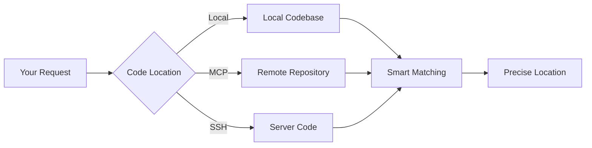
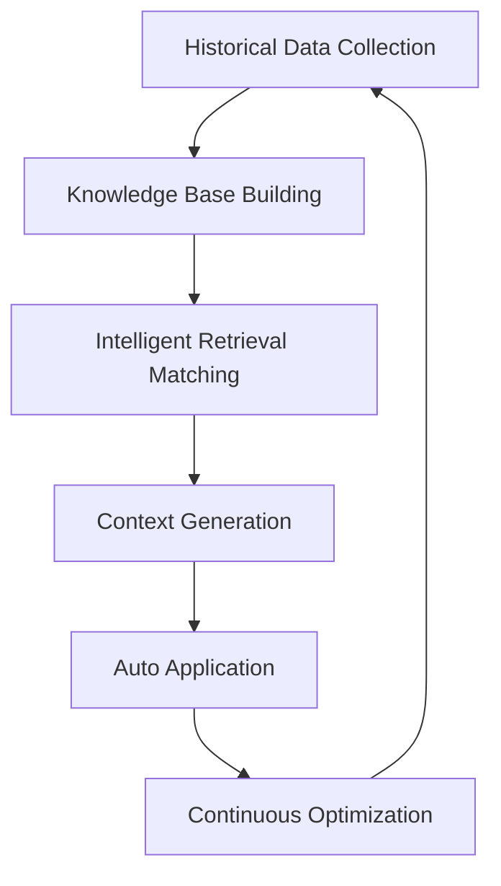
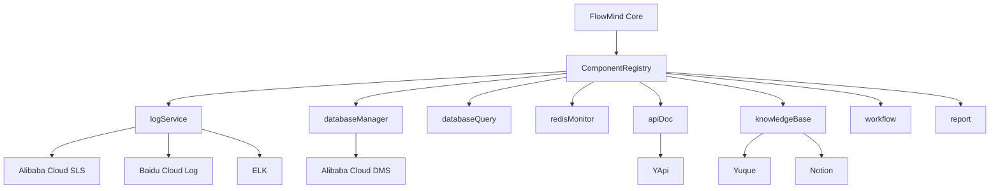
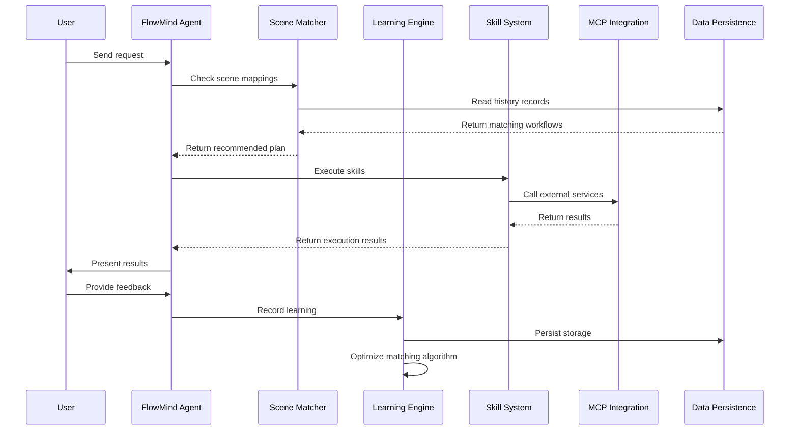
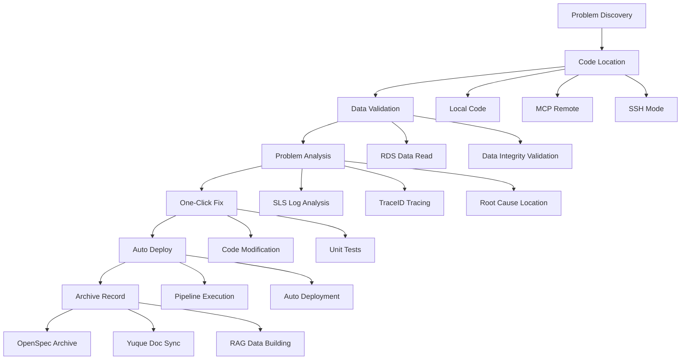

<div align="center">

# 🧠 FlowMind

### **The AI Agent That Learns How You Work**

*An adaptive memory and workflow layer for MCP-based developer tools.*

[](LICENSE)
[](CONTRIBUTING.md)
[](CHANGELOG.md)

[中文](README_CN.md) | [Quick Start](#-quick-start) | [Demo](demo/DEMO.md) | [How It Works](#-how-it-works) | [Use Cases](#-use-cases) | [Architecture](#-architecture)

</div>

---

## One Core Value

FlowMind helps you **teach a developer workflow once and reuse it later**.

Today, the most reliable path in this repository is:

1. Route a request to a skill
2. Execute that skill through a configured adapter or MCP-compatible provider
3. Capture explicit user feedback
4. Re-apply that preference on the next similar run

If you want one sentence:

> FlowMind is a memory layer for repetitive MCP-based developer operations.

## A Runnable Example

For a longer walkthrough, see [demo/DEMO.md](demo/DEMO.md).

```bash
# 1. Install
npm install -g flowmind

# 2. Inspect available skills
flowmind skills --json

# 3. Run a real workflow through the log-audit skill
flowmind process --skill log-audit "查询 traceId abc123 的日志"

# 4. Give explicit feedback
flowmind "下次用表格格式"

# 5. Programmatic / Codex-friendly access
flowmind-codex --skill log-audit "查询 traceId abc123 的日志"
```

What you get today:
- Skill routing
- MCP/provider-aware execution contracts
- Explicit feedback capture
- Local persistence for preferences and learning

What this project is not yet:
- A full autonomous coding agent
- A complete SSH/remote code execution platform
- A one-click deploy system for every workflow

## Quick Start

```bash
npm install -g flowmind
flowmind init
flowmind skills --json
flowmind process --skill log-audit "查询 traceId abc123 的日志"
```

If you are integrating with Codex or scripts:

```bash
flowmind-codex skills
flowmind-codex --skill log-audit "查询 traceId abc123 的日志"
```

FlowMind stores learning data locally and uses that state to apply explicit feedback on future runs.

---

## 🧠 How It Works

### 1. Multi-Source Code Location



**Supported Modes:**
- 📁 **Local Mode** - Directly read local codebase
- 🔌 **MCP Mode** - Connect remote repositories via MCP protocol
- 🔐 **SSH Mode** - SSH connection to read server code

### 2. RAG Intelligent Retrieval



**RAG Process:**
- 📚 **Data Collection** - Collect historical learning records, workflows, best practices
- 🔍 **Smart Matching** - Based on scene similarity calculation, recommend best matching workflows
- 📝 **Context Generation** - Auto-generate context, reduce repetitive input
- 🔄 **Continuous Optimization** - Every use optimizes matching algorithms

### 3. Learning Feedback Mechanism


**Learning Types:**
- 📚 **Correction Learning** - "No, use table format" → Auto-remembered
- 🗺️ **Scene Learning** - "Check errors first then traces" → Workflow recorded
- ⚙️ **Preference Learning** - "Reply in Chinese" → Language preference saved
- 🔄 **Auto Application** - Automatically uses learned workflows next time

### 4. Pluggable Component Architecture

FlowMind uses a **pluggable component architecture** that supports switching between cloud providers (Alibaba Cloud, Baidu Cloud, ELK, etc.) through configuration, without modifying skill code.



**8 Component Types:**

| Component Type | Default Provider | Description |
|----------------|------------------|-------------|
| `logService` | aliyun-sls | Cloud log querying and analysis |
| `databaseManager` | aliyun-dms | Database instance management |
| `databaseQuery` | aliyun-rds-query | Direct database SQL queries |
| `redisMonitor` | aliyun-redis | Redis monitoring via Prometheus |
| `apiDoc` | yapi | API documentation management |
| `knowledgeBase` | yuque | Knowledge base and documents |
| `workflow` | friday-flow | Automated workflow and pipelines |
| `report` | friday-report | Test and coverage reporting |

**Switching providers is config-only:**

```json
{
  "components": {
    "logService": {
      "default": "baidu-sls",
      "providers": {
        "baidu-sls": { "adapter": "baidu-sls-adapter", "enabled": true }
      }
    }
  }
}
```

---

## 📊 Use Cases

### Scenario 1: Online Problem Investigation

```bash
# Traditional way (10+ steps):
1. Login to SLS console
2. Enter query conditions
3. Find traceId
4. Copy traceId
5. Search traces
6. Locate error
7. Connect RDS
8. Query data
9. Analyze cause
10. Modify code
11. Submit deployment
12. Write documentation

# FlowMind way (1 command):
flowmind "排查线上问题 traceId abc123"
# → Auto complete: SLS query → Trace tracking → RDS data validation → Code location → Fix suggestion
```

### Scenario 2: Code Review

```bash
# Set your standards (only once)
flowmind "代码审查先检查安全漏洞，再检查代码质量，最后检查性能"

# Every review follows your standards
flowmind "审查这个 PR"
# → Security first → Quality check → Performance analysis
```

### Scenario 3: API Documentation Sync

```bash
# Generate docs from code
flowmind "从代码注释生成 API 文档"

# Sync to YApi
flowmind "同步接口到 YApi"

# Auto update Yuque
flowmind "同步 API 文档到语雀"
```

### Scenario 4: Data Validation

```bash
# Connect RDS to validate data
flowmind "验证订单表数据完整性"

# Auto execute checks
# → Referential integrity → Data types → Business logic → State machine
```

### Scenario 5: Project Health Check

```bash
# Full review
flowmind "审查项目整体状况"

# Auto execute:
# → Dependency analysis → Security audit → Code complexity → Test coverage → Technical debt
```

### Scenario 6: Project Onboarding

```bash
# New to a project? FlowMind helps you understand fast
flowmind "帮我理解这个项目的整体架构"

# FlowMind learns from senior devs' patterns:
# → Project structure analysis → Core module explanation → Data flow mapping
# → Key design decisions → Development guidelines → Suggested learning path
```

### Scenario 7: Design & Architecture Guidance

```bash
# Facing a design choice? FlowMind draws from accumulated experience
flowmind "这个功能应该用 Redis 还是 MongoDB？"

# FlowMind applies learned design thinking:
# → Your project context → Current tech stack → Performance requirements
# → Historical similar decisions → Trade-off analysis → Data-driven recommendation
```

---

## 📖 CLI Reference

### Skill Management

```bash
# List all available skills
flowmind skills
flowmind skills --verbose          # Show detailed info
flowmind skills --json             # JSON output (for tool integration)
flowmind skills --category quality # Filter by category

# View single skill info
flowmind skill log-audit
flowmind skill log-audit --json    # JSON output
flowmind skill log-audit --read    # Read SKILL.md content
flowmind skill log-audit --config  # Show configuration

# Modify skill configuration
flowmind skill log-audit --set defaultFormat sequential-list
flowmind skill code-review --set security.enabled true
```

### Resource Management

```bash
# List resource files
flowmind resource --list
flowmind resource --list learning
flowmind resource --list --json    # JSON output

# View/edit files
flowmind resource --show config.json
flowmind resource --edit config.json

# Show resource configuration
flowmind resource --config
flowmind resource --config --json
```

### Other Commands

```bash
# Process request
flowmind process "your request"
flowmind process --skill log-audit "query logs"

# Manage learning
flowmind learn --list
flowmind learn --export learnings.json

# Scene management
flowmind scenes --list
flowmind scenes --add

# Show statistics
flowmind stats

# Configuration
flowmind config --list
flowmind config --set learning.enabled true
```

### Tool Integration (Codex/Claude)

All commands support `--json` flag for programmatic access:

```bash
# Get skills list as JSON
flowmind skills --json

# Get skill info as JSON
flowmind skill log-audit --json

# Get resource list as JSON
flowmind resource --list --json
```

---

## 🏗️ Architecture

### System Architecture

```
┌──────────────────────────────────────────────────────────────────┐
│                        FlowMind Agent                            │
├──────────────────────────────────────────────────────────────────┤
│  ┌──────────────┐  ┌──────────────┐  ┌──────────────┐          │
│  │ Scene Matcher│  │Learning Engine│  │ Skill Loader │          │
│  └──────────────┘  └──────────────┘  └──────────────┘          │
├──────────────────────────────────────────────────────────────────┤
│  ┌──────────────────────────────────────────────────────────┐  │
│  │               ComponentRegistry (Pluggable)               │  │
│  ├──────────┬──────────┬──────────┬──────────┬──────────────┤  │
│  │logService│database  │apiDoc    │knowledge │workflow/report│  │
│  │Adapter   │Manager   │Adapter   │Base      │Adapters      │  │
│  └──────────┴──────────┴──────────┴──────────┴──────────────┘  │
├──────────────────────────────────────────────────────────────────┤
│  ┌──────────────────────────────────────────────────────────┐  │
│  │                     Skill System                          │  │
│  ├─────────────┬─────────────┬─────────────┬────────────────┤  │
│  │ Analysis    │ Integration │ Quality     │ Automation     │  │
│  └─────────────┴─────────────┴─────────────┴────────────────┘  │
├──────────────────────────────────────────────────────────────────┤
│  ┌──────────────────────────────────────────────────────────┐  │
│  │               Cloud Provider Adapters                     │  │
│  ├──────────┬──────────┬──────────┬──────────┬──────────────┤  │
│  │Aliyun SLS│Aliyun DMS│   YApi   │  Yuque   │Friday Flow   │  │
│  │Baidu Log │Baidu DMS │ Swagger  │ Notion   │Friday Report │  │
│  │ELK       │Custom DB │          │Confluence│              │  │
│  └──────────┴──────────┴──────────┴──────────┴──────────────┘  │
├──────────────────────────────────────────────────────────────────┤
│  ┌──────────────────────────────────────────────────────────┐  │
│  │                   Data Persistence Layer                   │  │
│  ├─────────────┬─────────────┬───────────────────────────────┤  │
│  │Learning     │Scene        │Component Config               │  │
│  │Records      │Mappings     │& Settings                     │  │
│  └─────────────┴─────────────┴───────────────────────────────┘  │
└──────────────────────────────────────────────────────────────────┘
```

### Directory Structure

```
flowmind/
├── core/                          # Core Engine
│   ├── index.js                  # Main entry
│   ├── learning-engine.js        # Learning engine
│   ├── scene-matcher.js          # Scene matching
│   ├── skill-loader.js           # Skill loading
│   ├── config-manager.js         # Config management
│   ├── component-types.js        # Component type definitions
│   ├── component-registry.js     # Pluggable component registry
│   ├── mcp-compatibility.js      # MCP backward compatibility
│   ├── adapters/                 # Adapter interfaces
│   │   ├── base-adapter.js       # Abstract base adapter
│   │   ├── mcp-adapter.js        # MCP adapter base
│   │   ├── log-service-adapter.js
│   │   ├── database-manager-adapter.js
│   │   ├── database-query-adapter.js
│   │   ├── knowledge-base-adapter.js
│   │   ├── api-doc-adapter.js
│   │   ├── workflow-adapter.js
│   │   └── report-adapter.js
│   └── providers/                # Provider implementations
│       ├── aliyun/               # Alibaba Cloud adapters
│       │   ├── sls-adapter.js
│       │   ├── dms-adapter.js
│       │   └── redis-adapter.js
│       ├── yapi/                 # YApi adapter
│       │   └── yapi-adapter.js
│       ├── yuque/                # Yuque adapter
│       │   └── yuque-adapter.js
│       └── friday/               # Friday platform adapters
│           ├── flow-adapter.js
│           └── report-adapter.js
├── scripts/                       # Migration tools
│   └── migrate-config.js         # Config migration tool
├── skills/                        # Skill Modules (17 core skills)
│   ├── log-audit/                # Log audit
│   ├── sls-log-audit/            # SLS log audit (chain tracing)
│   ├── resource-bind/            # Resource binding
│   ├── code-review/              # Code review
│   ├── code-review-audit/        # Code review audit (3D review)
│   ├── data-validation/          # Data validation
│   ├── data-logic-validation/    # Data logic validation
│   ├── api-sync/                 # API sync
│   ├── yapi-sync-interface/      # YApi interface sync
│   ├── yuque-sync-design/        # Yuque design doc sync
│   ├── project-review/           # Project review
│   ├── git-review/               # Git review
│   ├── archive-change/           # Change archiving
│   ├── auto-flow/                # Workflow automation
│   ├── learning-engine/          # Learning engine
│   ├── learning-feedback/        # Learning feedback (global)
│   └── requirement-analyst/      # Requirement analyst (6D analysis)
├── learning/                      # Learning Storage
│   ├── records/                  # Learning records
│   └── scenes.json               # Scene mappings
├── templates/                     # Output templates
└── config/                        # Configuration files
```

### Learning Flow



### One-Stop Problem Solving Flow



---

## ✨ Features

### 🏗️ Core Architecture

FlowMind is built on **enterprise-grade architecture design standards**, incorporating extensive experience from architects and senior developers:

- 📐 **OpenSpec Design Standards** - Standardized skill definitions and interface specifications
- 🧠 **RAG Business Logic** - Intelligent retrieval and generation based on historical data
- 💾 **Data Persistence** - All learning records and configurations stored locally
- ⚙️ **Global Config Initialization** - One-time setup, permanent effect, no repeated configuration
- 🔌 **Pluggable Components** - Switch cloud providers (Alibaba Cloud, Baidu Cloud, ELK, etc.) via config without code changes

### 🔧 Skill System (17 Core Skills)

#### 📊 Analysis Skills

| Skill | Description |
|-------|-------------|
| 🔍 **log-audit** | Log Audit - Time filtering, service filtering, level filtering, keyword search, TraceID tracing, performance analysis |
| 🔗 **sls-log-audit** | SLS Log Audit - Alibaba Cloud SLS log query, TraceID chain analysis, Feign call chain extraction, response time analysis |
| 🔎 **project-review** | Project Review - Dependency analysis, security audit, license compliance, code complexity, test coverage, technical debt assessment |
| 📋 **git-review** | Git Review - Commit quality analysis, change size assessment, impact analysis, risk evaluation, dependency change detection |
| 📐 **requirement-analyst** | Requirement Analyst - Historical design principles, iteration rationale, extensibility, market roadmap, req-code deviation, upgrade vulnerabilities |

#### 🔌 Integration Skills

| Skill | Description |
|-------|-------------|
| 🔗 **resource-bind** | Resource Bind - MySQL/PostgreSQL connection management, Redis operations, REST API integration, authentication management |
| 📚 **api-sync** | API Sync - Generate docs from code annotations, OpenAPI/Swagger spec generation, client SDK generation, version management |
| 📋 **yapi-sync-interface** | YApi Interface Sync - Sync Controller interfaces to YApi, Swagger import/export, interface management |
| 📖 **yuque-sync-design** | Yuque Design Sync - Sync OpenSpec design docs to Yuque, knowledge base management, document archiving |
| ✅ **data-validation** | Data Validation - Referential integrity checks, data type validation, business logic verification, state machine validation, duplicate detection |
| 🔬 **data-logic-validation** | Data Logic Validation - Verify actual SQL queries and Redis logic via MCP database/Redis connections |

#### 🛠️ Quality Skills

| Skill | Description |
|-------|-------------|
| 🔒 **code-review** | Code Review - SQL injection detection, XSS vulnerability scanning, authentication issues, code style, complexity analysis, design pattern checks |
| 🛡️ **code-review-audit** | Code Review Audit - Three-dimensional review: security audit, design compliance, mandatory constraint validation before merge/test |
| 📝 **archive-change** | Archive Change - Archive completed changes, auto-generate change summary, update changelog, create knowledge base entries, link Issue/PR |

#### ⚡ Automation Skills

| Skill | Description |
|-------|-------------|
| 🔄 **auto-flow** | Auto Flow - Sequential execution, parallel execution, conditional branching, error handling, workflow templates, team sharing |

#### 🧠 Intelligence Skills

| Skill | Description |
|-------|-------------|
| 🎯 **learning-engine** | Learning Engine - Correction learning, scene learning, preference learning, auto-application, learning loop, knowledge graph construction |
| 📝 **learning-feedback** | Learning Feedback (Global) - Capture user corrections, scene mapping, auto-bind to relevant skills, continuous optimization |

### 🎯 Core Capabilities Explained

#### 1️⃣ OpenSpec Design Standards
```
Standardized skill definitions → Unified interface specifications → Plug and play
```
- Each skill has a standard SKILL.md definition file
- Unified trigger conditions, feature descriptions, and examples
- Support for custom skill extensions

#### 2️⃣ RAG Business Logic
```
Historical data collection → Intelligent retrieval matching → Context generation → Auto application
```
- Intelligent matching based on historical learning records
- Scene similarity calculation and recommendations
- Context-aware workflow application

#### 3️⃣ Data Persistence
```
Learning records → Local storage → Permanent retention → Cross-session reuse
```
- All learning records stored locally and persistently
- Configuration information permanently retained
- Support import/export for team sharing

#### 4️⃣ Global Config Initialization
```
flowmind init → One-time configuration → Permanent effect
```
- Run `flowmind init` to complete initialization
- Configure resource connections, learning preferences, output formats
- No need to repeat setup each time

#### 5️⃣ Learning Feedback Mechanism (Self-Evolution)
```
User correction → Record learning → Auto apply → Continuous optimization
```
- **Correction Learning**: "No, use table format" → Auto-remembered
- **Scene Learning**: "Check errors first then traces" → Workflow recorded
- **Preference Learning**: "Reply in Chinese" → Language preference saved
- **Auto Application**: Automatically uses learned workflows next time

#### 6️⃣ Pluggable Component Architecture (Full Configuration)
```
Component Type → Provider Interface → Cloud Service Adapter → Switch via Config
```

**Key Design Principles:**
- 🔌 **Provider Abstraction** - Each component type defines a standard interface; providers implement the interface
- ⚙️ **Config-Driven Switching** - Switch cloud providers by modifying JSON config, zero code changes
- 🔗 **MCP Backward Compatibility** - Existing MCP server configurations continue to work seamlessly
- 🧩 **Custom Extensibility** - Register your own adapters for proprietary or third-party services

**Component Lifecycle:**
```
flowmind init → Load component-config.json → Register adapters → Activate default providers
                              ↓
                   Skills call ComponentRegistry.getAdapter(type)
                              ↓
                   Adapter delegates to MCP server or custom implementation
```

**MCP Server to Component Mapping:**

| MCP Server | Component Type | Provider |
|------------|----------------|----------|
| `friday-sls-logs` | `logService` | `aliyun-sls` |
| `aliyun-dms-mcp-server` | `databaseManager` | `aliyun-dms` |
| `friday-rds-redis-query` | `databaseQuery` | `aliyun-rds-query` |
| `friday-aliyun-sz-rds-redis` | `redisMonitor` | `aliyun-redis` |
| `yapi-mcp` | `apiDoc` | `yapi` |
| `yuque-mcp` | `knowledgeBase` | `yuque` |
| `friday-auto-flow` | `workflow` | `friday-flow` |
| `friday-auto-report` | `report` | `friday-report` |

### 🛠️ Custom Adapter Development

Create your own adapter to integrate proprietary or third-party services.

**Step 1: Extend the Base Adapter**

```javascript
// core/providers/custom/my-sls-adapter.js
const LogServiceAdapter = require('../../adapters/log-service-adapter');

class MyCustomSlsAdapter extends LogServiceAdapter {
  constructor(config = {}) {
    super('my-custom-sls', config);
    // Register MCP tool name mappings
    this.registerTool('queryLogs', 'myQueryLogsTool');
  }

  get mcpServer() {
    return 'my-custom-mcp-server';
  }

  async queryLogs(params) {
    // Custom implementation
    return { mcpServer: this.mcpServer, tool: this.resolveTool('queryLogs'), params };
  }
}

module.exports = MyCustomSlsAdapter;
```

**Step 2: Register the Provider Factory**

```javascript
// In your initialization code
const registry = new ComponentRegistry(config);

registry.registerFactory('my-custom-sls', () => {
  const MyCustomSlsAdapter = require('./providers/custom/my-sls-adapter');
  return new MyCustomSlsAdapter(config.get('components.logService.providers.my-custom-sls'));
});
```

**Step 3: Configure the Provider**

```json
{
  "components": {
    "logService": {
      "default": "my-custom-sls",
      "providers": {
        "my-custom-sls": {
          "adapter": "my-custom-sls-adapter",
          "enabled": true,
          "mcpServer": "my-custom-mcp-server",
          "config": {
            "endpoint": "my-sls.example.com"
          }
        }
      }
    }
  }
}
```

**Adapter Interface Requirements by Component Type:**

| Component Type | Required Methods | Required Capabilities |
|----------------|------------------|----------------------|
| `logService` | `queryLogs()`, `listProjects()` | Log querying and project listing |
| `databaseManager` | `listInstances()`, `executeScript()`, `searchDatabase()` | Instance management and SQL execution |
| `databaseQuery` | `queryExec()`, `fetchSource()`, `fetchTables()` | Direct SQL queries |
| `redisMonitor` | `query()`, `queryRange()`, `getLabelValues()` | Prometheus metric queries |
| `apiDoc` | `searchApis()`, `saveApi()`, `getCategories()` | API doc CRUD |
| `knowledgeBase` | `getRepos()`, `getDocs()`, `createDoc()`, `updateDoc()` | Knowledge base CRUD |
| `workflow` | `listPipelines()`, `startPipelineRun()` | Pipeline management |
| `report` | `listBuilds()`, `getBuildInfo()` | Build report retrieval |

### 📦 Configuration Migration Tool

Migrate existing MCP server configurations to the new component architecture.

```bash
# Preview migration (dry run)
node scripts/migrate-config.js --dry-run

# Generate migration config
node scripts/migrate-config.js

# Specify custom output path
node scripts/migrate-config.js --output ./my-config.json
```

**What it does:**
1. Reads existing MCP server configuration from `.claude/settings.local.json`
2. Maps MCP servers to component types using the default mapping table
3. Generates a `component-config.json` with proper structure

**Migration output example:**
```json
{
  "version": "1.0.0",
  "components": {
    "logService": {
      "default": "aliyun-sls",
      "providers": {
        "aliyun-sls": {
          "adapter": "aliyun-sls-adapter",
          "enabled": true,
          "mcpServer": "friday-sls-logs"
        }
      }
    }
  }
}
```

---

## 📈 Impact & Metrics

| Metric | Before FlowMind | After FlowMind |
|--------|-----------------|----------------|
| Repetitive instructions | 100% | ~5% |
| Workflow consistency | Variable | 98%+ |
| Problem investigation time | 30+ min | 5 min |
| Onboarding new devs | 2 weeks | 2 days |
| Token consumption | High | Reduce 60%+ |
| Experience retention | Cannot preserve | Permanent reuse |
| Design decision quality | Trial and error | Experience-backed |

---

## 🌟 Community Building

**FlowMind's Core Philosophy: More Users, Smarter Together!**

### Why We Need You?

```
Everyone's work habits → Combined into intelligent knowledge base
Your every use → Makes FlowMind understand developers better
Your every correction → Helps everyone improve efficiency
```

### How to Participate?

1. **Use & Feedback** - Use FlowMind daily, tell us what can be better
2. **Share Workflows** - Share your workflows with team and community
3. **Contribute Code** - Add skills, improve algorithms, optimize experience
4. **Spread the Word** - Let more developers know about FlowMind

### Benefits of Participation

- 🚀 **Personal Efficiency** - Let FlowMind handle repetitive work
- 🧠 **Collective Wisdom** - Combine experiences from millions of developers
- 🌍 **Open Source Sharing** - All learning成果 shared openly
- 🤝 **Community Recognition** - Contributors permanently recorded

**Let's build smarter developer tools together!**

---

## 🤝 Contributing

We welcome contributions! See [CONTRIBUTING.md](CONTRIBUTING.md) for details.

### Ways to Contribute
- 🐛 Report bugs
- 💡 Suggest features
- 📝 Improve docs
- 🛠️ Add skills
- 🌍 Translations
- 🧪 Write tests

---

## 📄 License

MIT License - see [LICENSE](LICENSE) for details.

---

## 🎓 Your Team Mentor

FlowMind becomes a valuable assistant for every role through continuous learning from team experience:

### 👨‍💻 For Developers: Quality Control & End-to-End Design

- **Full-Process Design Guidance** - From requirements analysis to architecture design, FlowMind learns team design patterns and provides experience-backed guidance at every step
- **Code Quality Control** - Absorbs team Code Review standards and best practices, providing real-time feedback during development
- **Technical Decision Support** - Based on historical project experience, provides data-backed support for tech stack and architecture decisions

### 🧪 For Testers: Review-Driven Quality & Requirements Alignment

- **Code Review Quality Control** - Learns team review standards, helping testers identify potential issues at the code level
- **Requirements Tracing** - Automatically links requirements to code implementation, ensuring complete test coverage without missing edge cases
- **Historical Defect Learning** - Learns from past Bug patterns, identifies high-risk areas proactively for precise test resource allocation

### 📦 For Product Managers: Learn from History, Plan for the Future

- **Historical Design Analysis** - Traces historical resources and design evolution, helping product understand "why it was designed this way"
- **Upgrade Path Planning** - Based on historical iteration patterns and technical architecture constraints, derives reasonable feature evolution directions
- **Feasibility Assessment** - Combines technical implementation costs with historical experience to inform product decisions

> *FlowMind doesn't replace anyone—it preserves and transmits team design wisdom, quality standards, and product experience across time and roles, enabling every role to make better decisions standing on the shoulders of those before them.*

---

## 🙏 Acknowledgments

Built with:
- Claude AI - Intelligence backbone
- MCP Protocol - Tool integration
- OpenSpec - Design standards
- Open source community - Inspiration and support

---

## 📞 Contact

- **GitHub**: [github.com/Eleven-M/flowmind](https://github.com/Eleven-M/flowmind)
- **Email**: 13060993305@163.com

---

<div align="center">

**[⬆ back to top](#-flowmind)**

Made with ❤️ by the FlowMind team

*"Learn once, flow forever"*

</div>
