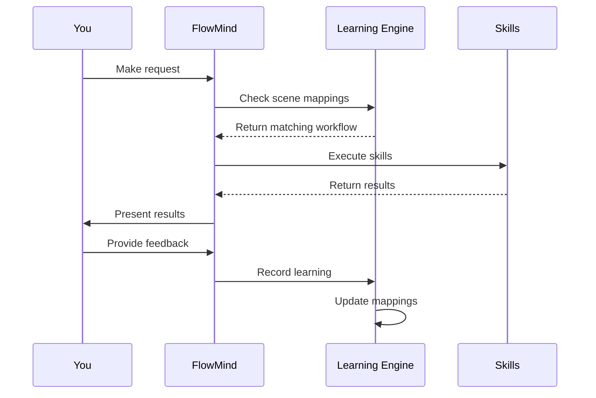

<](LICENSE)
[](CONTRIBUTING.md)
[](CHANGELOG.md)

[Quick Start](#-quick-start) • [How It Works](#-how-it-works) • [Use Cases](#-use-cases) • [Architecture](#-architecture) • [Roadmap](#-roadmap)

</div>

---

## 🎯 The Problem

Developers waste **20-30% of their time** repeating the same instructions to AI tools:

```
❌ Every single time:
"Format output as table..."
"Use sequential list..."
"Check errors first then..."
"Connect using source_id..."
```

## 💡 The Solution

**FlowMind learns once, applies forever.**

```
✅ First time: You teach FlowMind
✅ Every time after: FlowMind remembers
```

---

## 🚀 Quick Start

### Installation

```bash
npm install -g flowmind
```

### Initialize

```bash
flowmind init
```

### Start Using

```bash
# First time - teach FlowMind your preference
flowmind "查询 traceId 日志，用顺序列表格式"
FlowMind: [Executes and learns your preference]

# Next time - FlowMind remembers!
flowmind "查询 traceId abc123 的日志"
FlowMind: [Automatically uses sequential list format] ✓
```

---

## 🧠 How It Works

### 1. Learning from Corrections


**Example:**
```
You: "查询日志"
FlowMind: [Returns tree format]
You: "不对，用顺序列表"
FlowMind: [Records preference]

You: [Next time] "查询日志"
FlowMind: [Uses sequential list automatically] ✓
```

### 2. Scene Mapping

Map specific request patterns to workflows:

```
You: "查询线上日志用 SLS 技能，格式用顺序列表"
FlowMind: [Records scene mapping]

You: [Any time] "查询线上日志..."
FlowMind: [Auto-applies your workflow] ✓
```

### 3. Skill System

Modular skills for different tasks:

| Skill | What It Does |
|-------|--------------|
| 🔍 **Log Audit** | Log analysis, trace visualization |
| 🔌 **Resource Bind** | Database, Redis, API connections |
| 📝 **Code Review** | Code quality, security checks |
| ✅ **Data Validation** | Business logic verification |
| 📚 **API Sync** | Documentation synchronization |

---

## 📊 Use Cases

### 1. Automated Log Analysis

```bash
# Teach once
flowmind "查询 traceId 日志用顺序列表，显示 URL、入参、响应"

# Use forever
flowmind "查询 traceId abc123"
# → Automatically uses your preferred format
```

### 2. Consistent Code Review

```bash
# Set your standards
flowmind "代码审查先检查安全漏洞，再检查代码质量"

# Every review follows your order
flowmind "审查这个 PR"
# → Security first, then quality
```

### 3. Streamlined Debugging

```bash
# Define your workflow
flowmind "排查问题先查错误日志，再查链路，最后查代码"

# Consistent debugging every time
flowmind "排查线上问题 xxx"
# → Follows your defined workflow
```

---

## 🏗️ Architecture

```
flowmind/
├── core/                      # Core engine
│   ├── agent.js              # Main agent logic
│   ├── learning.js           # Learning engine
│   └── matcher.js            # Scene matching
├── skills/                    # Skill modules
│   ├── log-audit/           # Log analysis
│   ├── resource-bind/       # Resource management
│   ├── code-review/         # Code review
│   └── learning-engine/     # Learning system
├── learning/                  # Learning storage
│   ├── records/             # Learning records
│   └── scenes.json          # Scene mappings
└── templates/                # Output templates
```

### Learning Flow



---

## 📈 Impact & Metrics

| Metric | Before FlowMind | After FlowMind |
|--------|-----------------|----------------|
| Repetitive instructions | 100% | ~5% |
| Workflow consistency | Variable | 98%+ |
| Debugging time | 30 min | 10 min |
| Onboarding new devs | 2 weeks | 2 days |

---

## 🛣️ Roadmap

### Phase 1: Foundation ✅
- [x] Core learning engine
- [x] Scene mapping
- [x] Basic skill system
- [x] CLI interface

### Phase 2: Intelligence (Q3 2026)
- [ ] Multi-modal learning (screenshots, diagrams)
- [ ] Natural language workflow definition
- [ ] Smart suggestions

### Phase 3: Collaboration (Q4 2026)
- [ ] Team knowledge sharing
- [ ] Workflow templates marketplace
- [ ] Analytics dashboard

### Phase 4: Enterprise (Q1 2027)
- [ ] SSO integration
- [ ] Audit logging
- [ ] Custom skill SDK
- [ ] Priority support

---

## 🏢 Enterprise & Commercial

### Open Source (Free)
- Core learning engine
- Basic skills
- Personal use
- Community support

### Team ($29/user/month)
- Team knowledge sharing
- Workflow templates
- Priority support
- Analytics

### Enterprise (Custom)
- Custom skills development
- SSO & audit logging
- Dedicated support
- SLA guarantees

[Contact us](mailto:hello@flowmind.dev) for enterprise inquiries.

---

## 🤝 Contributing

We welcome contributions! See [CONTRIBUTING.md](CONTRIBUTING.md) for details.

### Ways to Contribute
- 🐛 Report bugs
- 💡 Suggest features
- 📝 Improve docs
- 🛠️ Add skills
- 🌍 Translations

---

## 📄 License

MIT License - see [LICENSE](LICENSE) for details.

---

## 🙏 Acknowledgments

Built with:
- Claude AI - Intelligence backbone
- Open source community - Inspiration and support

---

## 📞 Contact

- **Website**: [flowmind.dev](https://flowmind.dev)
- **GitHub**: [github.com/flowmind](https://github.com/flowmind)
- **Twitter**: [@flowmindai](https://twitter.com/flowmindai)
- **Email**: hello@flowmind.dev
- **Discord**: [Join community](https://discord.gg/flowmind)

---

<div align="center">

**[⬆ back to top](#flowmind)**

Made with ❤️ by the FlowMind team

*"Learn once, flow forever"*

</div>
]]>