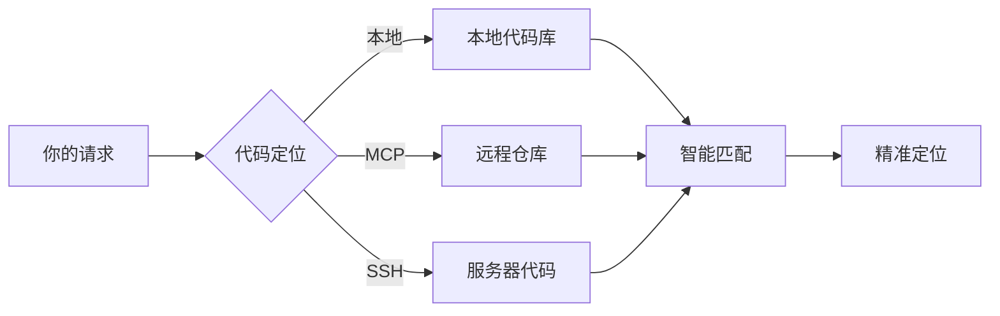
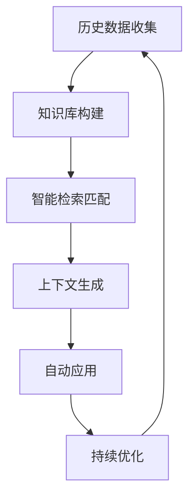
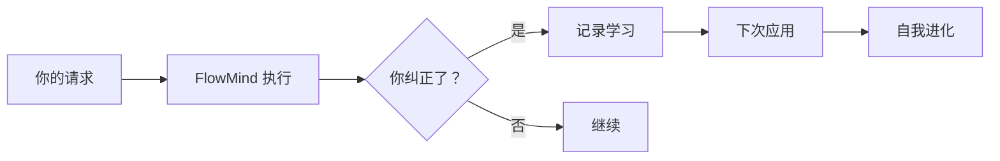
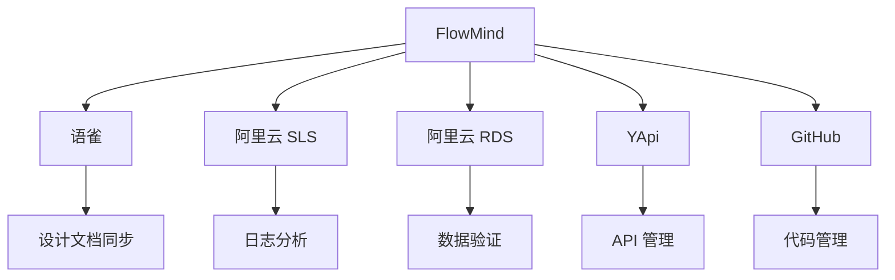
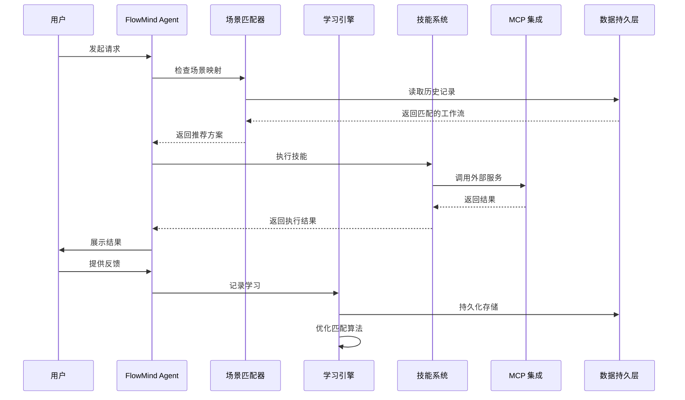
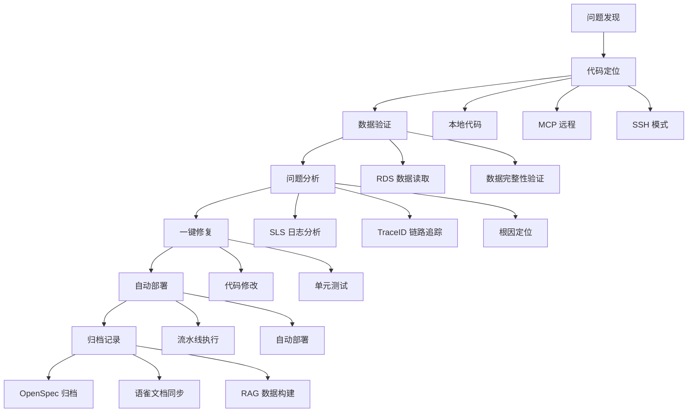

<div align="center">

# 🧠 FlowMind

### **学习你工作方式的 AI 智能体**

*不再重复自己。FlowMind 学习你的工作流程并自动应用。*

[](LICENSE)
[](CONTRIBUTING.md)
[](CHANGELOG.md)

[English](README.md) | [快速开始](#-快速开始) | [工作原理](#-工作原理) | [使用场景](#-使用场景) | [架构](#-架构)

</div>

---

## 🎯 问题所在

开发者在日常工作中面临诸多痛点：

### 1. 重复劳动
```
❌ 每次都要重复相同的指令：
"输出格式用表格..."
"用顺序列表..."
"先检查错误再..."
"用 source_id 连接..."
```

### 2. 工具分散
```
❌ 在多个平台间频繁切换：
SLS 查日志 → RDS 查数据 → 代码库定位 → YApi 查接口 → 语雀写文档
```

### 3. 经验流失
```
❌ 宝贵的经验无法沉淀：
架构师的设计思路 → 随项目结束而丢失
调试的排查路径 → 下次又要重新摸索
最佳实践 → 无法复用和传承
```

### 4. 效率低下
```
❌ 重复等待和低效操作：
每次连接数据库都要配置
每次查日志都要输完整条件
每次部署都要手动执行多个步骤
```

---

## 💡 解决方案

**FlowMind 学习一次，永久应用。**

### 核心理念

```
✅ 第一次：你教 FlowMind
✅ 之后每次：FlowMind 自动记住
✅ 越用越懂你：AI 自我进化
```

### 一站式解决

```
代码定位 → 数据验证 → 问题分析 → 一键修复 → 自动部署 → 归档记录
   ↓           ↓           ↓           ↓           ↓           ↓
本地+MCP    RDS读取    SLS分析    代码修改    流水线执行   OpenSpec+语雀
```

### 越用越智能

- 🧠 **学习积累** - 每次使用都在积累经验，越用越懂你的代码和思路
- 🔄 **场景联动** - 不同场景下的技能自动配合，形成完整工作流
- 💰 **Token 优化** - 通过映射文件减少 token 消耗，降低 AI 调用成本
- ⏱️ **效率提升** - 减少重复等待，自动化处理提升 10 倍效率
- 🎓 **经验沉淀** - 架构师和高级开发者的设计思路，永久保留复用

---

## 🚀 快速开始

### 安装

```bash
npm install -g flowmind
```

### 初始化

```bash
flowmind init
```

> 一次配置，永久生效。配置资源连接、学习偏好、输出格式，无需每次重复设置。

### 开始使用

```bash
# 第一次 - 教 FlowMind 你的偏好
flowmind "查询 traceId 日志，用顺序列表格式"
FlowMind: [执行并学习你的偏好]

# 下次 - FlowMind 自动记住！
flowmind "查询 traceId abc123 的日志"
FlowMind: [自动使用顺序列表格式] ✓
```

---

## 🧠 工作原理

### 1. 多源代码定位



**支持模式：**
- 📁 **本地模式** - 直接读取本地代码库
- 🔌 **MCP 模式** - 通过 MCP 协议连接远程仓库
- 🔐 **SSH 模式** - SSH 连接服务器读取代码

### 2. RAG 智能检索



**RAG 流程：**
- 📚 **数据收集** - 收集历史学习记录、工作流、最佳实践
- 🔍 **智能匹配** - 基于场景相似度计算，推荐最匹配的工作流
- 📝 **上下文生成** - 自动生成上下文，减少重复输入
- 🔄 **持续优化** - 每次使用都在优化匹配算法

### 3. 学习反馈机制



**学习类型：**
- 📚 **纠正学习** - "不对，用表格格式" → 自动记住
- 🗺️ **场景学习** - "排查问题先查错误再查链路" → 记录工作流
- ⚙️ **偏好学习** - "用中文回复" → 记录语言偏好
- 🔄 **自动应用** - 下次自动使用学习到的工作流

### 4. MCP 集成生态



**集成能力：**

| 平台 | 集成能力 |
|------|----------|
| 📖 **语雀 (Yuque)** | 设计文档同步、知识库管理、OpenSpec 归档 |
| 📊 **阿里云 SLS** | 日志实时查询、TraceID 链路追踪、异常定位分析 |
| 🗄️ **阿里云 RDS** | 数据库连接、数据读取验证、SQL 执行分析 |
| 📋 **YApi** | API 文档同步、接口测试、Swagger 导入导出 |
| 🐙 **GitHub** | 代码仓库管理、PR 审查、Issue 追踪、自动归档 |

---

## 📊 使用场景

### 场景 1：线上问题排查

```bash
# 传统方式（10+ 步骤）：
1. 登录 SLS 控制台
2. 输入查询条件
3. 找到 traceId
4. 复制 traceId
5. 查找链路
6. 定位错误
7. 连接 RDS
8. 查询数据
9. 分析原因
10. 修改代码
11. 提交部署
12. 写文档归档

# FlowMind 方式（1 个命令）：
flowmind "排查线上问题 traceId abc123"
# → 自动完成：SLS 查询 → 链路追踪 → RDS 数据验证 → 代码定位 → 修复建议
```

### 场景 2：代码审查

```bash
# 设置你的标准（只需一次）
flowmind "代码审查先检查安全漏洞，再检查代码质量，最后检查性能"

# 每次审查都遵循你的标准
flowmind "审查这个 PR"
# → 安全优先 → 质量检查 → 性能分析
```

### 场景 3：API 文档同步

```bash
# 从代码生成文档
flowmind "从代码注释生成 API 文档"

# 同步到 YApi
flowmind "同步接口到 YApi"

# 自动更新语雀
flowmind "同步 API 文档到语雀"
```

### 场景 4：数据验证

```bash
# 连接 RDS 验证数据
flowmind "验证订单表数据完整性"

# 自动执行检查
# → 引用完整性 → 数据类型 → 业务逻辑 → 状态机
```

### 场景 5：项目健康检查

```bash
# 全面审查
flowmind "审查项目整体状况"

# 自动执行：
# → 依赖分析 → 安全审计 → 代码复杂度 → 测试覆盖率 → 技术债务
```

---

## 🏗️ 架构

### 系统架构

```
┌─────────────────────────────────────────────────────────────┐
│                      FlowMind Agent                        │
├─────────────────────────────────────────────────────────────┤
│  ┌──────────────┐  ┌──────────────┐  ┌──────────────┐    │
│  │   场景匹配器  │  │   学习引擎   │  │   技能加载器  │    │
│  └──────────────┘  └──────────────┘  └──────────────┘    │
├─────────────────────────────────────────────────────────────┤
│  ┌─────────────────────────────────────────────────────┐  │
│  │                    技能系统                          │  │
│  ├─────────────┬─────────────┬─────────────┬───────────┤  │
│  │  分析类技能  │  集成类技能  │  质量类技能  │ 自动化技能 │  │
│  └─────────────┴─────────────┴─────────────┴───────────┘  │
├─────────────────────────────────────────────────────────────┤
│  ┌─────────────────────────────────────────────────────┐  │
│  │                    MCP 集成层                        │  │
│  ├─────────┬─────────┬─────────┬─────────┬─────────────┤  │
│  │  语雀   │   SLS   │   RDS   │   YApi  │   GitHub   │  │
│  └─────────┴─────────┴─────────┴─────────┴─────────────┘  │
├─────────────────────────────────────────────────────────────┤
│  ┌─────────────────────────────────────────────────────┐  │
│  │                    数据持久层                        │  │
│  ├─────────────┬─────────────┬─────────────────────────┤  │
│  │  学习记录   │  场景映射   │  配置信息                │  │
│  └─────────────┴─────────────┴─────────────────────────┘  │
└─────────────────────────────────────────────────────────────┘
```

### 目录结构

```
flowmind/
├── core/                          # 核心引擎
│   ├── index.js                  # 主入口
│   ├── learning-engine.js        # 学习引擎
│   ├── scene-matcher.js          # 场景匹配
│   ├── skill-loader.js           # 技能加载
│   └── config-manager.js         # 配置管理
├── skills/                        # 技能模块（11 个核心技能）
│   ├── log-audit/                # 日志审计
│   ├── resource-bind/            # 资源绑定
│   ├── code-review/              # 代码审查
│   ├── data-validation/          # 数据验证
│   ├── api-sync/                 # API 同步
│   ├── project-review/           # 项目审查
│   ├── git-review/               # Git 审查
│   ├── archive-change/           # 变更归档
│   ├── auto-flow/                # 工作流自动化
│   └── learning-engine/          # 学习引擎
├── learning/                      # 学习存储
│   ├── records/                  # 学习记录
│   └── scenes.json               # 场景映射
├── templates/                     # 输出模板
└── config/                        # 配置文件
```

### 学习流程



### 一站式问题解决流程



---

## ✨ 功能特性

### 🏗️ 核心架构

FlowMind 基于**企业级架构设计规范**构建，融合了大量架构师和高级开发者的实践经验：

- 📐 **OpenSpec 设计规范** - 标准化的技能定义和接口规范
- 🧠 **RAG 业务处理逻辑** - 基于历史数据的智能检索和生成
- 💾 **数据持久化** - 所有学习记录和配置本地持久化存储
- ⚙️ **全局配置初始化** - 一次配置，永久生效，无需反复设置

### 🔧 技能系统（11 个核心技能）

#### 📊 分析类技能

| 技能 | 功能说明 |
|------|----------|
| 🔍 **log-audit** | 日志审计 - 时间过滤、服务筛选、级别过滤、关键词搜索、TraceID 链路追踪、性能分析 |
| 🔎 **project-review** | 项目审查 - 依赖分析、安全审计、许可证合规、代码复杂度、测试覆盖率、技术债务评估 |
| 📋 **git-review** | Git 审查 - 提交质量分析、变更大小评估、影响分析、风险评估、依赖变更检测 |

#### 🔌 集成类技能

| 技能 | 功能说明 |
|------|----------|
| 🔗 **resource-bind** | 资源绑定 - MySQL/PostgreSQL 连接管理、Redis 操作、REST API 集成、认证管理 |
| 📚 **api-sync** | API 同步 - 从代码注释生成文档、OpenAPI/Swagger 规范生成、客户端 SDK 生成、版本管理 |
| ✅ **data-validation** | 数据验证 - 引用完整性检查、数据类型验证、业务逻辑验证、状态机验证、重复检测 |

#### 🛠️ 质量类技能

| 技能 | 功能说明 |
|------|----------|
| 🔒 **code-review** | 代码审查 - SQL 注入检测、XSS 漏洞扫描、认证问题、代码风格、复杂度分析、设计模式检查 |
| 📝 **archive-change** | 变更归档 - 完成变更归档、自动生成变更摘要、更新日志、创建知识库条目、关联 Issue/PR |

#### ⚡ 自动化技能

| 技能 | 功能说明 |
|------|----------|
| 🔄 **auto-flow** | 工作流自动化 - 顺序执行、并行执行、条件分支、错误处理、工作流模板、团队共享 |

#### 🧠 智能类技能

| 技能 | 功能说明 |
|------|----------|
| 🎯 **learning-engine** | 学习引擎 - 纠正学习、场景学习、偏好学习、自动应用、学习循环、知识图谱构建 |

### 🎯 核心能力详解

#### 1️⃣ OpenSpec 设计规范
```
标准化的技能定义 → 统一的接口规范 → 即插即用
```
- 每个技能都有标准的 SKILL.md 定义文件
- 统一的触发条件、功能说明、示例规范
- 支持自定义技能扩展

#### 2️⃣ RAG 业务处理逻辑
```
历史数据收集 → 智能检索匹配 → 上下文生成 → 自动应用
```
- 基于历史学习记录的智能匹配
- 场景相似度计算和推荐
- 上下文感知的工作流应用

#### 3️⃣ 数据持久化留存
```
学习记录 → 本地存储 → 永久保留 → 跨会话复用
```
- 所有学习记录本地持久化存储
- 配置信息永久保留
- 支持导入导出，团队共享

#### 4️⃣ 全局配置初始化
```
flowmind init → 一次性配置 → 永久生效
```
- 运行 `flowmind init` 完成初始化
- 配置资源连接、学习偏好、输出格式
- 无需每次重复设置

#### 5️⃣ 学习反馈机制（自我进化）
```
用户纠正 → 记录学习 → 自动应用 → 持续优化
```
- **纠正学习**: "不对，用表格格式" → 自动记住
- **场景学习**: "排查问题先查错误再查链路" → 记录工作流
- **偏好学习**: "用中文回复" → 记录语言偏好
- **自动应用**: 下次自动使用学习到的工作流

---

## 📈 影响与指标

| 指标 | 使用 FlowMind 前 | 使用 FlowMind 后 |
|------|------------------|------------------|
| 重复指令 | 100% | ~5% |
| 工作流一致性 | 不稳定 | 98%+ |
| 问题排查时间 | 30+ 分钟 | 5 分钟 |
| 新人上手时间 | 2 周 | 2 天 |
| Token 消耗 | 高 | 降低 60%+ |
| 经验沉淀 | 无法保留 | 永久复用 |

---

## 🌟 社区共建

**FlowMind 的核心理念：越多人使用，越智能！**

### 为什么需要你的参与？

```
每个人的工作习惯 → 汇聚成智能知识库
你的每一次使用 → 让 FlowMind 更懂开发者
你的每一次纠正 → 帮助所有人提升效率
```

### 如何参与共建？

1. **使用并反馈** - 用 FlowMind 完成日常工作，告诉我们哪里可以更好
2. **分享工作流** - 将你定义的工作流分享给团队和社区
3. **贡献代码** - 添加新技能、改进学习算法、优化体验
4. **传播理念** - 让更多开发者知道 FlowMind

### 共建收益

- 🚀 **个人提效** - 重复工作交给 FlowMind
- 🧠 **集体智慧** - 汇聚千万开发者的工作经验
- 🌍 **开源共享** - 所有学习成果开源共享
- 🤝 **社区认可** - 贡献者将被永久记录

**让我们一起构建更智能的开发工具！**

---

## 🤝 贡献

欢迎贡献！详见 [CONTRIBUTING.md](CONTRIBUTING.md)。

### 贡献方式
- 🐛 报告 Bug
- 💡 建议功能
- 📝 改进文档
- 🛠️ 添加技能
- 🌍 翻译
- 🧪 编写测试

---

## 📄 许可证

MIT 许可证 - 详见 [LICENSE](LICENSE)。

---

## 🙏 致谢

基于以下技术构建：
- Claude AI - 智能核心
- MCP 协议 - 工具集成
- OpenSpec - 设计规范
- 开源社区 - 灵感与支持

---

## 📞 联系方式

- **GitHub**: [github.com/Eleven-M/flowmind](https://github.com/Eleven-M/flowmind)
- **邮箱**: 13060993305@163.com

---

<div align="center">

**[⬆ 回到顶部](#-flowmind)**

由 FlowMind 团队用 ❤️ 制作

*"学习一次，永远流畅"*

</div>
