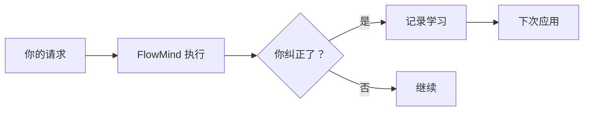
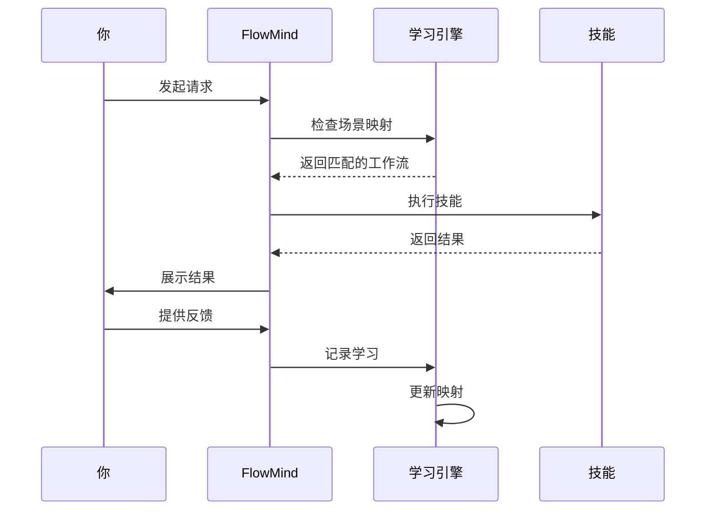

<div align="center">

# 🧠 FlowMind

### **学习你工作方式的 AI 智能体**

*不再重复自己。FlowMind 学习你的工作流程并自动应用。*

[](LICENSE)
[](CONTRIBUTING.md)
[](CHANGELOG.md)

[English](README.md) | [快速开始](#-快速开始) | [工作原理](#-工作原理) | [使用场景](#-使用场景) | [架构](#-架构) | [路线图](#-路线图)

</div>

---

## 🎯 问题所在

开发者浪费 **20-30% 的时间** 向 AI 工具重复相同的指令：

```
❌ 每次都要说：
"输出格式用表格..."
"用顺序列表..."
"先检查错误再..."
"用 source_id 连接..."
```

## 💡 解决方案

**FlowMind 学习一次，永久应用。**

```
✅ 第一次：你教 FlowMind
✅ 之后每次：FlowMind 自动记住
```

---

## 🚀 快速开始

### 安装

```bash
npm install -g flowmind
```

### 初始化

```bash
flowmind init
```

### 开始使用

```bash
# 第一次 - 教 FlowMind 你的偏好
flowmind "查询 traceId 日志，用顺序列表格式"
FlowMind: [执行并学习你的偏好]

# 下次 - FlowMind 自动记住！
flowmind "查询 traceId abc123 的日志"
FlowMind: [自动使用顺序列表格式] ✓
```

---

## 🧠 工作原理

### 1. 从纠正中学习



**示例：**
```
你: "查询日志"
FlowMind: [返回树形格式]
你: "不对，用顺序列表"
FlowMind: [记录偏好]

你: [下次] "查询日志"
FlowMind: [自动使用顺序列表格式] ✓
```

### 2. 场景映射

将特定请求模式映射到工作流：

```
你: "查询线上日志用 SLS 技能，格式用顺序列表"
FlowMind: [记录场景映射]

你: [任何时候] "查询线上日志..."
FlowMind: [自动应用你的工作流] ✓
```

### 3. 技能系统

针对不同任务的模块化技能：

| 技能 | 功能 |
|------|------|
| 🔍 **日志审计** | 日志分析、链路可视化 |
| 🔌 **资源绑定** | 数据库、Redis、API 连接 |
| 📝 **代码审查** | 代码质量、安全检查 |
| ✅ **数据验证** | 业务逻辑验证 |
| 📚 **API 同步** | 文档同步 |

---

## 📊 使用场景

### 1. 自动化日志分析

```bash
# 教一次
flowmind "查询 traceId 日志用顺序列表，显示 URL、入参、响应"

# 永久使用
flowmind "查询 traceId abc123"
# → 自动使用你偏好的格式
```

### 2. 一致的代码审查

```bash
# 设置你的标准
flowmind "代码审查先检查安全漏洞，再检查代码质量"

# 每次审查都遵循你的顺序
flowmind "审查这个 PR"
# → 安全优先，然后是质量
```

### 3. 流畅的调试流程

```bash
# 定义你的工作流
flowmind "排查问题先查错误日志，再查链路，最后查代码"

# 每次都遵循一致的调试流程
flowmind "排查线上问题 xxx"
# → 遵循你定义的工作流
```

---

## 🏗️ 架构

```
flowmind/
├── core/                      # 核心引擎
│   ├── agent.js              # 主代理逻辑
│   ├── learning.js           # 学习引擎
│   └── matcher.js            # 场景匹配
├── skills/                    # 技能模块
│   ├── log-audit/           # 日志分析
│   ├── resource-bind/       # 资源管理
│   ├── code-review/         # 代码审查
│   └── learning-engine/     # 学习系统
├── learning/                  # 学习存储
│   ├── records/             # 学习记录
│   └── scenes.json          # 场景映射
└── templates/                # 输出模板
```

### 学习流程



---

## 📈 影响与指标

| 指标 | 使用 FlowMind 前 | 使用 FlowMind 后 |
|------|------------------|------------------|
| 重复指令 | 100% | ~5% |
| 工作流一致性 | 不稳定 | 98%+ |
| 调试时间 | 30 分钟 | 10 分钟 |
| 新人上手时间 | 2 周 | 2 天 |

---

## ✨ 功能特性

### 核心能力
- 🧠 **智能学习** - 从你的纠正中学习，记住偏好
- 🔄 **自动应用** - 下次自动使用学习到的工作流
- 🎯 **场景映射** - 将特定请求映射到工作流
- 📊 **格式记忆** - 记住你喜欢的输出格式

### 技能系统
- 🔍 **日志审计** - 日志分析、链路追踪
- 🔌 **资源绑定** - 数据库、Redis、API 连接
- 📝 **代码审查** - 代码质量、安全检查
- ✅ **数据验证** - 业务逻辑验证
- 📚 **API 同步** - 文档自动生成与同步

### 学习能力
- 📚 **纠正学习** - "不对，用表格格式" → 自动记住
- 🗺️ **场景学习** - "排查问题先查错误再查链路" → 记录工作流
- ⚙️ **偏好学习** - "用中文回复" → 记录语言偏好

---

## 🌟 社区共建

**FlowMind 的核心理念：越多人使用，越智能！**

### 为什么需要你的参与？

```
每个人的工作习惯 → 汇聚成智能知识库
你的每一次使用 → 让 FlowMind 更懂开发者
你的每一次纠正 → 帮助所有人提升效率
```

### 如何参与共建？

1. **使用并反馈** - 用 FlowMind 完成日常工作，告诉我们哪里可以更好
2. **分享工作流** - 将你定义的工作流分享给团队和社区
3. **贡献代码** - 添加新技能、改进学习算法、优化体验
4. **传播理念** - 让更多开发者知道 FlowMind

### 共建收益

- 🚀 **个人提效** - 重复工作交给 FlowMind
- 🧠 **集体智慧** - 汇聚千万开发者的工作经验
- 🌍 **开源共享** - 所有学习成果开源共享
- 🤝 **社区认可** - 贡献者将被永久记录

**让我们一起构建更智能的开发工具！**

---

## 🤝 贡献

欢迎贡献！详见 [CONTRIBUTING.md](CONTRIBUTING.md)。

### 贡献方式
- 🐛 报告 Bug
- 💡 建议功能
- 📝 改进文档
- 🛠️ 添加技能
- 🌍 翻译
- 🧪 编写测试

---

## 📄 许可证

MIT 许可证 - 详见 [LICENSE](LICENSE)。

---

## 🙏 致谢

基于以下技术构建：
- Claude AI - 智能核心
- 开源社区 - 灵感与支持

---

## 📞 联系方式

- **GitHub**: [github.com/Eleven-M/flowmind](https://github.com/Eleven-M/flowmind)
- **邮箱**: 13060993305@163.com

---

<div align="center">

**[⬆ 回到顶部](#-flowmind)**

由 FlowMind 团队用 ❤️ 制作

*"学习一次，永远流畅"*

</div>
