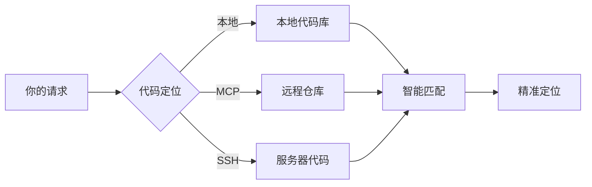
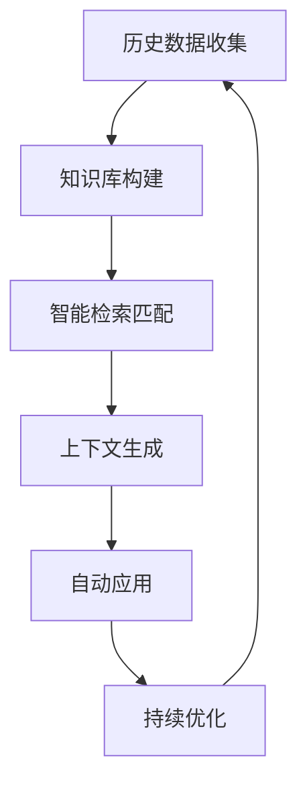
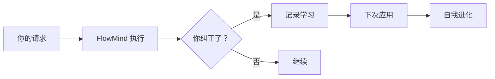
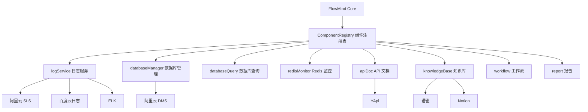
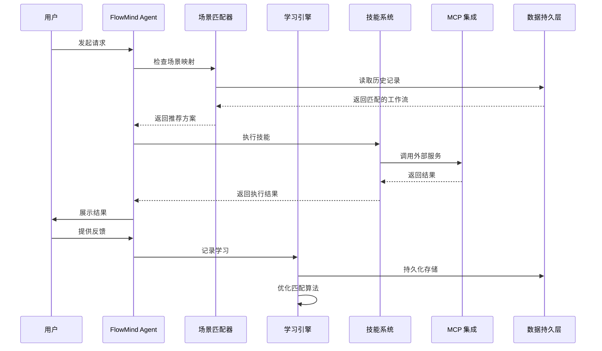
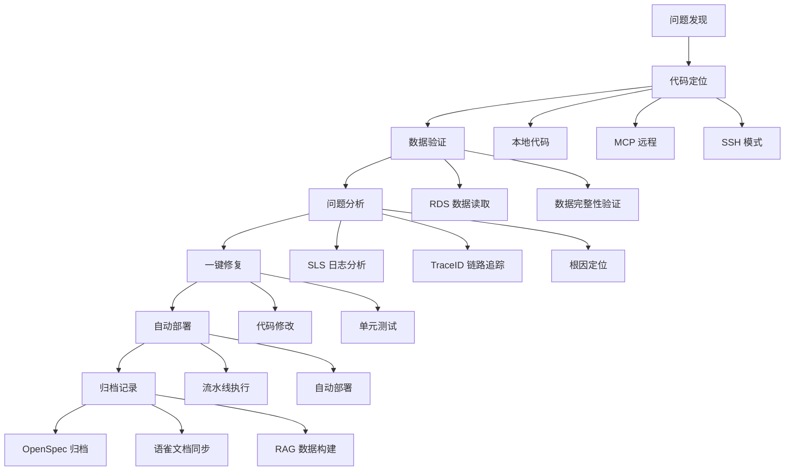

<div align="center">

# 🧠 FlowMind

### **学习你工作方式的 AI 智能体**

*一个面向 MCP 开发工作流的可学习记忆层。*

[](LICENSE)
[](CONTRIBUTING.md)
[](CHANGELOG.md)

[English](README.md) | [快速开始](#-快速开始) | [演示](demo/DEMO_CN.md) | [工作原理](#-工作原理) | [使用场景](#-使用场景) | [架构](#-架构)

</div>

---

## 一个核心价值

FlowMind 的目标不是“什么都做”，而是把**重复出现的开发工作流记住并复用**。

当前仓库里最可靠、最能跑通的一条主链路是：

1. 把请求路由到合适的 skill
2. 通过已配置的 adapter / MCP 兼容提供者执行 skill
3. 捕获用户的显式反馈
4. 在下次相似请求里复用这份偏好

一句话概括：

> FlowMind 是一个给 MCP 开发工具使用的记忆层。

## 一个可跑通的例子

更完整的演示见 [demo/DEMO_CN.md](demo/DEMO_CN.md)。

终端操作 GIF 演示：


```bash
# 1. 安装
npm install -g flowmind

# 2. 看看有哪些技能
flowmind skills --json

# 3. 走真正的日志技能链路
flowmind process --skill log-audit "查询 traceId abc123 的日志"

# 4. 给出显式反馈
flowmind "下次用表格格式"

# 5. 如果你在 Codex / 脚本里集成
flowmind-codex --skill log-audit "查询 traceId abc123 的日志"
```

现在已经具备的能力：
- skill 路由
- 面向 MCP/provider 的执行协议
- 显式反馈学习
- 本地持久化学习记录和偏好

当前还不应该过度承诺的部分：
- 不是完整的自治编码 Agent
- 不是通用 SSH 远程执行平台
- 不是所有工作流都已实现一键自动化

## 快速开始

```bash
npm install -g flowmind
flowmind init
flowmind skills --json
flowmind process --skill log-audit "查询 traceId abc123 的日志"
```

如果你要集成到 Codex 或脚本：

```bash
flowmind-codex skills
flowmind-codex --skill log-audit "查询 traceId abc123 的日志"
```

FlowMind 会把学习数据保存在本地，并在后续运行中应用这些显式反馈。

---

## 📖 使用方式

FlowMind 支持 4 种使用方式，满足不同场景需求：

### 方式1: CLI 独立使用

最简单的使用方式，无需 AI 模型，直接通过命令行调用。

```bash
# 单次执行
flowmind "查询 traceId abc123 的日志"
flowmind "审查代码质量"
flowmind "验证订单数据"

# 交互模式
flowmind

# 指定技能执行
flowmind process --skill log-audit "查询最近1小时的错误日志"
```

**特点：**
- ✅ 无需 AI 模型
- ✅ 基于规则引擎匹配
- ✅ 支持学习和记忆
- ✅ 离线可用

---

### 方式2: AI 模型直接接入

FlowMind 内置 AI 模型接入层，可直接调用 OpenAI、Anthropic、Ollama 等模型。

#### 配置 AI 模型

**方式 A：通过 CLI 初始化（推荐）**

```bash
# 配置 OpenAI
flowmind init --ai openai
# 会提示输入 API Key

# 配置 Anthropic
flowmind init --ai anthropic

# 配置 Ollama (本地模型)
flowmind init --ai ollama
```

**方式 B：手动配置**

创建 `~/.flowmind/ai-config.json`：

```json
{
  "ai": {
    "enabled": true,
    "defaultProvider": "openai",
    "fallbackToRules": true,
    "providers": {
      "openai": {
        "apiKey": "sk-your-api-key",
        "model": "gpt-4",
        "temperature": 0.3
      },
      "anthropic": {
        "apiKey": "sk-ant-your-api-key",
        "model": "claude-3-sonnet-20240229"
      },
      "ollama": {
        "baseUrl": "http://localhost:11434",
        "model": "llama2"
      }
    },
    "features": {
      "intentUnderstanding": true,
      "parameterExtraction": true,
      "skillSelection": true,
      "resultSummary": true,
      "learningFeedback": true
    }
  }
}
```

**方式 C：环境变量**

```bash
export OPENAI_API_KEY=sk-your-api-key
export ANTHROPIC_API_KEY=sk-ant-your-api-key
```

#### 测试 AI 连接

```bash
# 测试默认 Provider
flowmind ai --test

# 测试指定 Provider
flowmind ai --test openai
flowmind ai --test anthropic
```

#### 使用 AI 增强功能

```bash
# AI 会理解意图、提取参数、选择技能、生成摘要
flowmind "帮我查一下最近1小时用户服务的错误日志"

# AI 会分析复杂的多步骤任务
flowmind "排查线上问题：用户下单失败，需要查看日志、检查数据库、分析原因"
```

**特点：**
- ✅ 自然语言理解
- ✅ 智能参数提取
- ✅ 结果摘要生成
- ✅ 降级到规则引擎

---

### 方式3: Claude Code 集成（MCP Server）

让 Claude Code 直接调用 FlowMind 的内部流程。

#### 步骤 1：安装 FlowMind

```bash
npm install -g flowmind
```

#### 步骤 2：配置 MCP Server

在项目根目录创建 `.claude/settings.local.json`：

```json
{
  "mcpServers": {
    "flowmind": {
      "command": "flowmind-mcp",
      "args": [],
      "env": {
        "OPENAI_API_KEY": "${OPENAI_API_KEY}"
      }
    }
  }
}
```

或者使用完整路径：

```json
{
  "mcpServers": {
    "flowmind": {
      "command": "node",
      "args": ["/path/to/flowmind/mcp/server.js"]
    }
  }
}
```

#### 步骤 3：在 Claude Code 中使用

```
你：帮我查询最近1小时的错误日志

Claude：我来调用 FlowMind 帮你查询...
[调用 flowmind_process 工具]

你：审查一下这个项目的代码质量

Claude：我来使用 FlowMind 的代码审查技能...
[调用 flowmind_skill_code-review 工具]
```

#### 可用的 MCP 工具

| 工具名称 | 描述 |
|---------|------|
| `flowmind_process` | 处理请求的主入口 |
| `flowmind_list_skills` | 列出所有可用技能 |
| `flowmind_get_skill` | 获取技能详情 |
| `flowmind_ai_status` | 查看 AI 状态 |
| `flowmind_learning_stats` | 查看学习统计 |
| `flowmind_skill_<name>` | 执行特定技能 |

**特点：**
- ✅ Claude Code 直接调用
- ✅ 无需额外配置 MCP Server
- ✅ 保留学习和记忆功能
- ✅ 支持所有 FlowMind 技能

---

### 方式4: Codex 集成（JSON 输出）

通过 JSON 输出与 Codex 集成。

```bash
# 推荐：使用 Codex 包装命令
flowmind-codex "查询最近1小时的错误日志"
flowmind-codex skills
flowmind-codex skill log-audit
flowmind-codex doctor

# 默认使用当前工作区的 .flowmind-codex/
# 也可以自定义目录
# FLOWMIND_CODEX_HOME=/your/path flowmind-codex skills

# 获取技能列表 (JSON 格式)
flowmind skills --json

# 获取技能详情
flowmind skill log-audit --json

# 执行并输出 JSON
flowmind process --json "查询日志"
```

**Codex 脚本示例：**

```python
import subprocess
import json

def flowmind_query(query):
    result = subprocess.run(
        ['flowmind', 'process', '--json', query],
        capture_output=True,
        text=True
    )
    return json.loads(result.stdout)

# 使用
result = flowmind_query("查询 traceId abc123 的日志")
print(result)
```

---

### 使用方式对比

| 方式 | 适用场景 | 需要 AI | 需要 MCP | 特点 |
|------|---------|---------|----------|------|
| CLI 独立使用 | 快速执行、脚本集成 | ❌ | ❌ | 简单直接 |
| AI 模型接入 | 智能理解、复杂任务 | ✅ | ❌ | 自然语言 |
| Claude Code | 智能对话、多步骤 | ✅ | ✅ | 深度集成 |
| Codex 集成 | 自动化、CI/CD | ❌ | ❌ | 程序化调用 |

---

## 🧠 工作原理

### 1. 多源代码定位



**支持模式：**
- 📁 **本地模式** - 直接读取本地代码库
- 🔌 **MCP 模式** - 通过 MCP 协议连接远程仓库
- 🔐 **SSH 模式** - SSH 连接服务器读取代码

### 2. RAG 智能检索



**RAG 流程：**
- 📚 **数据收集** - 收集历史学习记录、工作流、最佳实践
- 🔍 **智能匹配** - 基于场景相似度计算，推荐最匹配的工作流
- 📝 **上下文生成** - 自动生成上下文，减少重复输入
- 🔄 **持续优化** - 每次使用都在优化匹配算法

### 3. 学习反馈机制



**学习类型：**
- 📚 **纠正学习** - "不对，用表格格式" → 自动记住
- 🗺️ **场景学习** - "排查问题先查错误再查链路" → 记录工作流
- ⚙️ **偏好学习** - "用中文回复" → 记录语言偏好
- 🔄 **自动应用** - 下次自动使用学习到的工作流

### 4. 可插拔组件架构

FlowMind 采用**可插拔组件架构**，支持通过配置切换云服务商（阿里云、百度云、ELK 等），无需修改技能代码。



**8 种组件类型：**

| 组件类型 | 默认提供者 | 说明 |
|----------|------------|------|
| `logService` | aliyun-sls | 云日志查询与分析 |
| `databaseManager` | aliyun-dms | 数据库实例管理 |
| `databaseQuery` | aliyun-rds-query | 数据库 SQL 直查 |
| `redisMonitor` | aliyun-redis | Redis Prometheus 监控 |
| `apiDoc` | yapi | API 文档管理 |
| `knowledgeBase` | yuque | 知识库与文档 |
| `workflow` | friday-flow | 自动化工作流与流水线 |
| `report` | friday-report | 测试与覆盖率报告 |

**切换提供者仅需修改配置：**

```json
{
  "components": {
    "logService": {
      "default": "baidu-sls",
      "providers": {
        "baidu-sls": { "adapter": "baidu-sls-adapter", "enabled": true }
      }
    }
  }
}
```

---

## 📊 使用场景

### 场景 1：线上问题排查

```bash
# 传统方式（10+ 步骤）：
1. 登录 SLS 控制台
2. 输入查询条件
3. 找到 traceId
4. 复制 traceId
5. 查找链路
6. 定位错误
7. 连接 RDS
8. 查询数据
9. 分析原因
10. 修改代码
11. 提交部署
12. 写文档归档

# FlowMind 方式（1 个命令）：
flowmind "排查线上问题 traceId abc123"
# → 自动完成：SLS 查询 → 链路追踪 → RDS 数据验证 → 代码定位 → 修复建议
```

### 场景 2：代码审查

```bash
# 设置你的标准（只需一次）
flowmind "代码审查先检查安全漏洞，再检查代码质量，最后检查性能"

# 每次审查都遵循你的标准
flowmind "审查这个 PR"
# → 安全优先 → 质量检查 → 性能分析
```

### 场景 3：API 文档同步

```bash
# 从代码生成文档
flowmind "从代码注释生成 API 文档"

# 同步到 YApi
flowmind "同步接口到 YApi"

# 自动更新语雀
flowmind "同步 API 文档到语雀"
```

### 场景 4：数据验证

```bash
# 连接 RDS 验证数据
flowmind "验证订单表数据完整性"

# 自动执行检查
# → 引用完整性 → 数据类型 → 业务逻辑 → 状态机
```

### 场景 5：项目健康检查

```bash
# 全面审查
flowmind "审查项目整体状况"

# 自动执行：
# → 依赖分析 → 安全审计 → 代码复杂度 → 测试覆盖率 → 技术债务
```

### 场景 6：项目快速上手

```bash
# 刚加入项目？FlowMind 帮你快速理解
flowmind "帮我理解这个项目的整体架构"

# FlowMind 从资深开发者的经验中学习：
# → 项目结构分析 → 核心模块讲解 → 数据流梳理
# → 关键设计决策 → 开发规范指引 → 推荐学习路径
```

### 场景 7：设计与架构指导

```bash
# 面临设计选择？FlowMind 借助积累的经验给出建议
flowmind "这个功能应该用 Redis 还是 MongoDB？"

# FlowMind 运用学到的设计思维：
# → 你的项目上下文 → 当前技术栈 → 性能需求
# → 历史类似决策 → 权衡分析 → 数据驱动的建议
```

---

## 📖 CLI 命令参考

### 技能管理

```bash
# 列出所有可用技能
flowmind skills
flowmind skills --verbose          # 显示详细信息
flowmind skills --json             # JSON 输出（用于工具集成）
flowmind skills --category quality # 按分类过滤

# 查看单个技能信息
flowmind skill log-audit
flowmind skill log-audit --json    # JSON 输出
flowmind skill log-audit --read    # 读取 SKILL.md 内容
flowmind skill log-audit --config  # 显示配置

# 修改技能配置
flowmind skill log-audit --set defaultFormat sequential-list
flowmind skill code-review --set security.enabled true
```

### 资源管理

```bash
# 列出资源文件
flowmind resource --list
flowmind resource --list learning
flowmind resource --list --json    # JSON 输出

# 查看/编辑文件
flowmind resource --show config.json
flowmind resource --edit config.json

# 显示资源配置
flowmind resource --config
flowmind resource --config --json
```

### 其他命令

```bash
# 处理请求
flowmind process "your request"
flowmind process --skill log-audit "query logs"

# 管理学习记录
flowmind learn --list
flowmind learn --export learnings.json

# 场景管理
flowmind scenes --list
flowmind scenes --add

# 显示统计信息
flowmind stats

# 配置管理
flowmind config --list
flowmind config --set learning.enabled true
```

### 工具集成（Codex/Claude）

所有命令支持 `--json` 参数用于程序化访问：

```bash
# 获取技能列表 JSON
flowmind skills --json

# 获取技能信息 JSON
flowmind skill log-audit --json

# 获取资源列表 JSON
flowmind resource --list --json
```

---

## 🏗️ 架构

### 系统架构

```
┌──────────────────────────────────────────────────────────────────┐
│                        FlowMind Agent                            │
├──────────────────────────────────────────────────────────────────┤
│  ┌──────────────┐  ┌──────────────┐  ┌──────────────┐          │
│  │   场景匹配器  │  │   学习引擎   │  │   技能加载器  │          │
│  └──────────────┘  └──────────────┘  └──────────────┘          │
├──────────────────────────────────────────────────────────────────┤
│  ┌──────────────────────────────────────────────────────────┐  │
│  │            ComponentRegistry 组件注册表（可插拔）           │  │
│  ├──────────┬──────────┬──────────┬──────────┬──────────────┤  │
│  │logService│database  │apiDoc    │knowledge │workflow/report│  │
│  │Adapter   │Manager   │Adapter   │Base      │Adapters      │  │
│  └──────────┴──────────┴──────────┴──────────┴──────────────┘  │
├──────────────────────────────────────────────────────────────────┤
│  ┌──────────────────────────────────────────────────────────┐  │
│  │                     技能系统                              │  │
│  ├─────────────┬─────────────┬─────────────┬────────────────┤  │
│  │  分析类技能  │  集成类技能  │  质量类技能  │  自动化技能    │  │
│  └─────────────┴─────────────┴─────────────┴────────────────┘  │
├──────────────────────────────────────────────────────────────────┤
│  ┌──────────────────────────────────────────────────────────┐  │
│  │                   云服务商适配器                           │  │
│  ├──────────┬──────────┬──────────┬──────────┬──────────────┤  │
│  │阿里云 SLS│阿里云 DMS│   YApi   │  语雀    │Friday Flow   │  │
│  │百度云日志 │百度云 DMS │ Swagger  │ Notion   │Friday Report │  │
│  │ELK       │自建数据库 │          │Confluence│              │  │
│  └──────────┴──────────┴──────────┴──────────┴──────────────┘  │
├──────────────────────────────────────────────────────────────────┤
│  ┌──────────────────────────────────────────────────────────┐  │
│  │                     数据持久层                            │  │
│  ├─────────────┬─────────────┬───────────────────────────────┤  │
│  │  学习记录   │  场景映射   │  组件配置与设置               │  │
│  └─────────────┴─────────────┴───────────────────────────────┘  │
└──────────────────────────────────────────────────────────────────┘
```

### 目录结构

```
flowmind/
├── core/                          # 核心引擎
│   ├── index.js                  # 主入口
│   ├── learning-engine.js        # 学习引擎
│   ├── scene-matcher.js          # 场景匹配
│   ├── skill-loader.js           # 技能加载
│   ├── config-manager.js         # 配置管理
│   ├── component-types.js        # 组件类型定义
│   ├── component-registry.js     # 可插拔组件注册表
│   ├── mcp-compatibility.js      # MCP 向后兼容层
│   ├── adapters/                 # 适配器接口
│   │   ├── base-adapter.js       # 抽象基类
│   │   ├── mcp-adapter.js        # MCP 适配器基类
│   │   ├── log-service-adapter.js
│   │   ├── database-manager-adapter.js
│   │   ├── database-query-adapter.js
│   │   ├── knowledge-base-adapter.js
│   │   ├── api-doc-adapter.js
│   │   ├── workflow-adapter.js
│   │   └── report-adapter.js
│   └── providers/                # 提供者实现
│       ├── aliyun/               # 阿里云适配器
│       │   ├── sls-adapter.js
│       │   ├── dms-adapter.js
│       │   └── redis-adapter.js
│       ├── yapi/                 # YApi 适配器
│       │   └── yapi-adapter.js
│       ├── yuque/                # 语雀适配器
│       │   └── yuque-adapter.js
│       └── friday/               # Friday 平台适配器
│           ├── flow-adapter.js
│           └── report-adapter.js
├── scripts/                       # 迁移工具
│   └── migrate-config.js         # 配置迁移工具
├── skills/                        # 技能模块（17 个核心技能）
│   ├── log-audit/                # 日志审计
│   ├── sls-log-audit/            # SLS 日志审查（链路追踪）
│   ├── resource-bind/            # 资源绑定
│   ├── code-review/              # 代码审查
│   ├── code-review-audit/        # 代码审查审核（三维审查）
│   ├── data-validation/          # 数据验证
│   ├── data-logic-validation/    # 数据逻辑验证
│   ├── api-sync/                 # API 同步
│   ├── yapi-sync-interface/      # YApi 接口同步
│   ├── yuque-sync-design/        # 语雀设计文档同步
│   ├── project-review/           # 项目审查
│   ├── git-review/               # Git 审查
│   ├── archive-change/           # 变更归档
│   ├── auto-flow/                # 工作流自动化
│   ├── learning-engine/          # 学习引擎
│   ├── learning-feedback/        # 学习反馈（全局）
│   └── requirement-analyst/      # 需求分析师（六维度分析）
├── learning/                      # 学习存储
│   ├── records/                  # 学习记录
│   └── scenes.json               # 场景映射
├── templates/                     # 输出模板
└── config/                        # 配置文件
```

### 学习流程



### 一站式问题解决流程



---

## ✨ 功能特性

### 🏗️ 核心架构

FlowMind 基于**企业级架构设计规范**构建，融合了大量架构师和高级开发者的实践经验：

- 📐 **OpenSpec 设计规范** - 标准化的技能定义和接口规范
- 🧠 **RAG 业务处理逻辑** - 基于历史数据的智能检索和生成
- 💾 **数据持久化** - 所有学习记录和配置本地持久化存储
- ⚙️ **全局配置初始化** - 一次配置，永久生效，无需反复设置
- 🔌 **可插拔组件** - 通过配置切换云服务商（阿里云、百度云、ELK 等），无需修改代码

### 🔧 技能系统（17 个核心技能）

#### 📊 分析类技能

| 技能 | 功能说明 |
|------|----------|
| 🔍 **log-audit** | 日志审计 - 时间过滤、服务筛选、级别过滤、关键词搜索、TraceID 链路追踪、性能分析 |
| 🔗 **sls-log-audit** | SLS 日志审查 - 阿里云 SLS 日志查询、TraceID 链路分析、Feign 调用链提取、响应耗时分析 |
| 🔎 **project-review** | 项目审查 - 依赖分析、安全审计、许可证合规、代码复杂度、测试覆盖率、技术债务评估 |
| 📋 **git-review** | Git 审查 - 提交质量分析、变更大小评估、影响分析、风险评估、依赖变更检测 |
| 📐 **requirement-analyst** | 需求分析师 - 历史设计原理、迭代演进、扩展性评估、市场路线、需求偏差、升级漏洞（六维度） |

#### 🔌 集成类技能

| 技能 | 功能说明 |
|------|----------|
| 🔗 **resource-bind** | 资源绑定 - MySQL/PostgreSQL 连接管理、Redis 操作、REST API 集成、认证管理 |
| 📚 **api-sync** | API 同步 - 从代码注释生成文档、OpenAPI/Swagger 规范生成、客户端 SDK 生成、版本管理 |
| 📋 **yapi-sync-interface** | YApi 接口同步 - Controller 接口同步到 YApi、Swagger 导入导出、接口管理 |
| 📖 **yuque-sync-design** | 语雀设计文档同步 - OpenSpec 设计文档同步到语雀、知识库管理、文档归档 |
| ✅ **data-validation** | 数据验证 - 引用完整性检查、数据类型验证、业务逻辑验证、状态机验证、重复检测 |
| 🔬 **data-logic-validation** | 数据逻辑验证 - 通过 MCP 连接数据库/Redis 验证实际 SQL 和缓存逻辑 |

#### 🛠️ 质量类技能

| 技能 | 功能说明 |
|------|----------|
| 🔒 **code-review** | 代码审查 - SQL 注入检测、XSS 漏洞扫描、认证问题、代码风格、复杂度分析、设计模式检查 |
| 🛡️ **code-review-audit** | 代码审查审核 - 三维审查：安全审计、设计合规、强制约束验证，合并/测试前审核 |
| 📝 **archive-change** | 变更归档 - 完成变更归档、自动生成变更摘要、更新日志、创建知识库条目、关联 Issue/PR |

#### ⚡ 自动化技能

| 技能 | 功能说明 |
|------|----------|
| 🔄 **auto-flow** | 工作流自动化 - 顺序执行、并行执行、条件分支、错误处理、工作流模板、团队共享 |

#### 🧠 智能类技能

| 技能 | 功能说明 |
|------|----------|
| 🎯 **learning-engine** | 学习引擎 - 纠正学习、场景学习、偏好学习、自动应用、学习循环、知识图谱构建 |
| 📝 **learning-feedback** | 学习反馈（全局） - 捕获用户修正、场景映射、自动绑定到相关技能、持续优化 |

### 🎯 核心能力详解

#### 1️⃣ OpenSpec 设计规范
```
标准化的技能定义 → 统一的接口规范 → 即插即用
```
- 每个技能都有标准的 SKILL.md 定义文件
- 统一的触发条件、功能说明、示例规范
- 支持自定义技能扩展

#### 2️⃣ RAG 业务处理逻辑
```
历史数据收集 → 智能检索匹配 → 上下文生成 → 自动应用
```
- 基于历史学习记录的智能匹配
- 场景相似度计算和推荐
- 上下文感知的工作流应用

#### 3️⃣ 数据持久化留存
```
学习记录 → 本地存储 → 永久保留 → 跨会话复用
```
- 所有学习记录本地持久化存储
- 配置信息永久保留
- 支持导入导出，团队共享

#### 4️⃣ 全局配置初始化
```
flowmind init → 一次性配置 → 永久生效
```
- 运行 `flowmind init` 完成初始化
- 配置资源连接、学习偏好、输出格式
- 无需每次重复设置

#### 5️⃣ 学习反馈机制（自我进化）
```
用户纠正 → 记录学习 → 自动应用 → 持续优化
```
- **纠正学习**: "不对，用表格格式" → 自动记住
- **场景学习**: "排查问题先查错误再查链路" → 记录工作流
- **偏好学习**: "用中文回复" → 记录语言偏好
- **自动应用**: 下次自动使用学习到的工作流

#### 6️⃣ 可插拔组件架构（完整配置化）
```
组件类型 → 提供者接口 → 云服务适配器 → 通过配置切换
```

**核心设计原则：**
- 🔌 **提供者抽象** - 每种组件类型定义标准接口，提供者实现该接口
- ⚙️ **配置驱动切换** - 修改 JSON 配置即可切换云服务商，零代码改动
- 🔗 **MCP 向后兼容** - 现有 MCP 服务器配置可无缝继续使用
- 🧩 **自定义扩展** - 注册自定义适配器，接入私有或第三方服务

**组件生命周期：**
```
flowmind init → 加载 component-config.json → 注册适配器 → 激活默认提供者
                              ↓
                   技能调用 ComponentRegistry.getAdapter(type)
                              ↓
                   适配器委托给 MCP 服务器或自定义实现
```

**MCP 服务器与组件映射：**

| MCP 服务器 | 组件类型 | 提供者 |
|------------|----------|--------|
| `friday-sls-logs` | `logService` | `aliyun-sls` |
| `aliyun-dms-mcp-server` | `databaseManager` | `aliyun-dms` |
| `friday-rds-redis-query` | `databaseQuery` | `aliyun-rds-query` |
| `friday-aliyun-sz-rds-redis` | `redisMonitor` | `aliyun-redis` |
| `yapi-mcp` | `apiDoc` | `yapi` |
| `yuque-mcp` | `knowledgeBase` | `yuque` |
| `friday-auto-flow` | `workflow` | `friday-flow` |
| `friday-auto-report` | `report` | `friday-report` |

### 🛠️ 自定义适配器开发

创建自定义适配器，接入私有或第三方服务。

**第一步：继承基础适配器**

```javascript
// core/providers/custom/my-sls-adapter.js
const LogServiceAdapter = require('../../adapters/log-service-adapter');

class MyCustomSlsAdapter extends LogServiceAdapter {
  constructor(config = {}) {
    super('my-custom-sls', config);
    // 注册 MCP 工具名称映射
    this.registerTool('queryLogs', 'myQueryLogsTool');
  }

  get mcpServer() {
    return 'my-custom-mcp-server';
  }

  async queryLogs(params) {
    // 自定义实现
    return { mcpServer: this.mcpServer, tool: this.resolveTool('queryLogs'), params };
  }
}

module.exports = MyCustomSlsAdapter;
```

**第二步：注册提供者工厂**

```javascript
// 在初始化代码中
const registry = new ComponentRegistry(config);

registry.registerFactory('my-custom-sls', () => {
  const MyCustomSlsAdapter = require('./providers/custom/my-sls-adapter');
  return new MyCustomSlsAdapter(config.get('components.logService.providers.my-custom-sls'));
});
```

**第三步：配置提供者**

```json
{
  "components": {
    "logService": {
      "default": "my-custom-sls",
      "providers": {
        "my-custom-sls": {
          "adapter": "my-custom-sls-adapter",
          "enabled": true,
          "mcpServer": "my-custom-mcp-server",
          "config": {
            "endpoint": "my-sls.example.com"
          }
        }
      }
    }
  }
}
```

**各组件类型的适配器接口要求：**

| 组件类型 | 必须实现的方法 | 必须具备的能力 |
|----------|----------------|----------------|
| `logService` | `queryLogs()`, `listProjects()` | 日志查询与项目列表 |
| `databaseManager` | `listInstances()`, `executeScript()`, `searchDatabase()` | 实例管理与 SQL 执行 |
| `databaseQuery` | `queryExec()`, `fetchSource()`, `fetchTables()` | 数据库直查 |
| `redisMonitor` | `query()`, `queryRange()`, `getLabelValues()` | Prometheus 指标查询 |
| `apiDoc` | `searchApis()`, `saveApi()`, `getCategories()` | API 文档 CRUD |
| `knowledgeBase` | `getRepos()`, `getDocs()`, `createDoc()`, `updateDoc()` | 知识库 CRUD |
| `workflow` | `listPipelines()`, `startPipelineRun()` | 流水线管理 |
| `report` | `listBuilds()`, `getBuildInfo()` | 构建报告获取 |

### 📦 配置迁移工具

将现有 MCP 服务器配置迁移到新的组件架构。

```bash
# 预览迁移（干运行）
node scripts/migrate-config.js --dry-run

# 生成迁移配置
node scripts/migrate-config.js

# 指定自定义输出路径
node scripts/migrate-config.js --output ./my-config.json
```

**工具功能：**
1. 从 `.claude/settings.local.json` 读取现有 MCP 服务器配置
2. 使用默认映射表将 MCP 服务器映射到组件类型
3. 生成结构化的 `component-config.json`

**迁移输出示例：**
```json
{
  "version": "1.0.0",
  "components": {
    "logService": {
      "default": "aliyun-sls",
      "providers": {
        "aliyun-sls": {
          "adapter": "aliyun-sls-adapter",
          "enabled": true,
          "mcpServer": "friday-sls-logs"
        }
      }
    }
  }
}
```

---

## 📈 影响与指标

| 指标 | 使用 FlowMind 前 | 使用 FlowMind 后 |
|------|------------------|------------------|
| 重复指令 | 100% | ~5% |
| 工作流一致性 | 不稳定 | 98%+ |
| 问题排查时间 | 30+ 分钟 | 5 分钟 |
| 新人上手时间 | 2 周 | 2 天 |
| Token 消耗 | 高 | 降低 60%+ |
| 经验沉淀 | 无法保留 | 永久复用 |
| 设计决策质量 | 靠经验摸索 | 有据可依 |

---

## 🌟 社区共建

**FlowMind 的核心理念：越多人使用，越智能！**

### 为什么需要你的参与？

```
每个人的工作习惯 → 汇聚成智能知识库
你的每一次使用 → 让 FlowMind 更懂开发者
你的每一次纠正 → 帮助所有人提升效率
```

### 如何参与共建？

1. **使用并反馈** - 用 FlowMind 完成日常工作，告诉我们哪里可以更好
2. **分享工作流** - 将你定义的工作流分享给团队和社区
3. **贡献代码** - 添加新技能、改进学习算法、优化体验
4. **传播理念** - 让更多开发者知道 FlowMind

### 共建收益

- 🚀 **个人提效** - 重复工作交给 FlowMind
- 🧠 **集体智慧** - 汇聚千万开发者的工作经验
- 🌍 **开源共享** - 所有学习成果开源共享
- 🤝 **社区认可** - 贡献者将被永久记录

**让我们一起构建更智能的开发工具！**

---

## 🤝 贡献

欢迎贡献！详见 [CONTRIBUTING.md](CONTRIBUTING.md)。

### 贡献方式
- 🐛 报告 Bug
- 💡 建议功能
- 📝 改进文档
- 🛠️ 添加技能
- 🌍 翻译
- 🧪 编写测试

---

## 📄 许可证

MIT 许可证 - 详见 [LICENSE](LICENSE)。

---

## 🎓 你的团队导师

FlowMind 通过持续学习团队的实践经验，成为不同角色的得力助手：

### 👨‍💻 对开发人员：把控质量，设计全流程化

- **全流程设计引导** - 从需求分析到架构设计，FlowMind 学习团队的设计模式，在每个环节提供经验支撑
- **编码质量把控** - 吸纳团队的 Code Review 标准和最佳实践，在编码阶段即时反馈
- **技术决策参考** - 基于历史项目经验，为技术选型和架构决策提供数据支撑

### 🧪 对测试人员：以 Review 驱动质量，以需求校准方向

- **代码 Review 质量把控** - 学习团队的审查标准，辅助测试人员从代码层面发现潜在问题
- **需求核对与追溯** - 将需求与代码实现自动关联，确保测试覆盖完整，不遗漏边界场景
- **历史缺陷学习** - 从过往 Bug 模式中学习，提前识别高风险区域，精准分配测试资源

### 📦 对产品人员：以史为鉴，推演未来发展

- **历史设计推敲** - 梳理历史资源和设计演进脉络，帮助产品理解"为什么这样设计"
- **升级路径规划** - 基于历史迭代规律和技术架构约束，推演合理的功能演进方向
- **需求可行性评估** - 结合技术实现成本和历史经验，为产品决策提供参考依据

> *FlowMind 不替代任何人——它将团队的设计智慧、质量标准和产品经验跨时间、跨角色地传承下去，让每个角色都能站在前人的肩膀上做出更好的决策。*

---

## 🙏 致谢

基于以下技术构建：
- Claude AI - 智能核心
- MCP 协议 - 工具集成
- OpenSpec - 设计规范
- 开源社区 - 灵感与支持

---

## 📞 联系方式

- **GitHub**: [github.com/Eleven-M/flowmind](https://github.com/Eleven-M/flowmind)
- **邮箱**: 13060993305@163.com

---

<div align="center">

**[⬆ 回到顶部](#-flowmind)**

由 FlowMind 团队用 ❤️ 制作

*"学习一次，永远流畅"*

</div>
