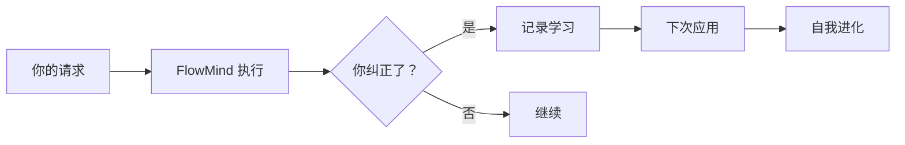

# 🧠 FlowMind：告别重复指令！这个 AI Agent 学会你的工作方式后，自动帮你干活

> **GitHub 传送门：** [https://github.com/Eleven-M/flowmind](https://github.com/Eleven-M/flowmind)
>
> 觉得不错的话，点个 Star 支持一下！

---

## 前言

作为开发者，你有没有遇到过这些场景？

```
❌ 每次查日志都要重复："用顺序列表格式，显示 URL、入参、响应..."
❌ 每次代码审查都要强调："先检查安全漏洞，再检查代码质量..."
❌ 排查问题时：SLS 查日志 → RDS 查数据 → 代码库定位 → YApi 查接口...
❌ 宝贵的调试经验，项目结束就丢了...
```

**每天浪费 20-30% 的时间在重复的事情上**，这让我很不爽。

于是，我开发了 **FlowMind** —— 一个能**学习你工作方式**的 AI Agent。

---

## FlowMind 是什么？

简单来说：**你教它一次，它记住一辈子。**

```
第一次：你告诉 FlowMind "查询日志用顺序列表格式"
之后每次：FlowMind 自动使用顺序列表格式，不用你再说
```

但这只是冰山一角。FlowMind 的核心能力远不止于此：

### 🔌 深度集成主流开发平台

| 平台 | 集成能力 |
|------|----------|
| 📖 **语雀** | 设计文档同步、知识库管理 |
| 📊 **阿里云 SLS** | 日志实时查询、TraceID 链路追踪 |
| 🗄️ **阿里云 RDS** | 数据库连接、数据读取验证 |
| 📋 **YApi** | API 文档同步、接口测试 |
| 🐙 **GitHub** | 代码仓库管理、PR 审查 |

### 🚀 一站式问题解决流程

以前排查一个线上问题需要 10+ 步骤：

```
登录 SLS → 查日志 → 找 traceId → 查链路 → 连 RDS → 查数据 → 定位代码 → 修改 → 部署 → 写文档
```

现在只需要 **1 个命令**：

```bash
flowmind "排查线上问题 traceId abc123"
```

FlowMind 自动完成：SLS 查询 → 链路追踪 → RDS 数据验证 → 代码定位 → 修复建议

---

## 核心特性

### 1. 多源代码定位

支持三种模式，自动读取和定位代码：

- 📁 **本地模式** - 直接读取本地代码库
- 🔌 **MCP 模式** - 通过 MCP 协议连接远程仓库
- 🔐 **SSH 模式** - SSH 连接服务器读取代码

### 2. RAG 智能检索

基于历史数据的智能匹配，越用越懂你：

```
历史数据收集 → 知识库构建 → 智能检索匹配 → 上下文生成 → 自动应用
```

### 3. 学习反馈机制（自我进化）



三种学习方式：
- **纠正学习**："不对，用表格格式" → 自动记住
- **场景学习**："排查问题先查错误再查链路" → 记录工作流
- **偏好学习**："用中文回复" → 记录语言偏好

### 4. 全局配置初始化

一次配置，永久生效：

```bash
flowmind init
# 配置资源连接、学习偏好、输出格式
# 之后再也不用重复设置
```

### 5. Token 优化

通过映射文件减少 token 消耗，降低 AI 调用成本 **60%+**。

---

## 11 个核心技能

FlowMind 内置了 11 个专业技能，覆盖开发全流程：

### 📊 分析类
- **log-audit** - 日志审计、TraceID 链路追踪、性能分析
- **project-review** - 项目审查、依赖分析、安全审计、技术债务评估
- **git-review** - Git 审查、提交质量分析、风险评估

### 🔌 集成类
- **resource-bind** - 数据库/Redis/API 连接管理
- **api-sync** - API 文档生成、OpenAPI/Swagger 规范、SDK 生成
- **data-validation** - 数据验证、业务逻辑验证、状态机验证

### 🛠️ 质量类
- **code-review** - 代码审查、SQL 注入检测、XSS 漏洞扫描
- **archive-change** - 变更归档、自动生成变更摘要、知识库条目

### ⚡ 自动化
- **auto-flow** - 工作流自动化、并行执行、条件分支、团队共享

### 🧠 智能类
- **learning-engine** - 学习引擎、纠正学习、场景学习、知识图谱构建

---

## 使用场景

### 场景 1：线上问题排查

```bash
# 传统方式：10+ 步骤，30+ 分钟
# FlowMind 方式：1 个命令，5 分钟

flowmind "排查线上问题 traceId abc123"
# → SLS 查询 → 链路追踪 → RDS 数据验证 → 代码定位 → 修复建议
```

### 场景 2：代码审查

```bash
# 设置标准（只需一次）
flowmind "代码审查先检查安全漏洞，再检查代码质量，最后检查性能"

# 每次审查都遵循你的标准
flowmind "审查这个 PR"
```

### 场景 3：API 文档同步

```bash
flowmind "从代码注释生成 API 文档"
flowmind "同步接口到 YApi"
flowmind "同步 API 文档到语雀"
```

### 场景 4：数据验证

```bash
flowmind "验证订单表数据完整性"
# → 引用完整性 → 数据类型 → 业务逻辑 → 状态机
```

---

## 快速开始

### 安装

```bash
npm install -g flowmind
```

### 初始化

```bash
flowmind init
```

### 开始使用

```bash
# 第一次 - 教 FlowMind 你的偏好
flowmind "查询 traceId 日志，用顺序列表格式"

# 下次 - FlowMind 自动记住！
flowmind "查询 traceId abc123 的日志"
# → 自动使用顺序列表格式 ✓
```

---

## 架构设计

FlowMind 采用分层架构设计：

```
┌─────────────────────────────────────────────────────────────┐
│                      FlowMind Agent                        │
├─────────────────────────────────────────────────────────────┤
│  场景匹配器  │  学习引擎  │  技能加载器  │  配置管理器     │
├─────────────────────────────────────────────────────────────┤
│                    技能系统（11 个核心技能）                  │
├─────────────────────────────────────────────────────────────┤
│              MCP 集成层（语雀/SLS/RDS/YApi/GitHub）         │
├─────────────────────────────────────────────────────────────┤
│              数据持久层（学习记录/场景映射/配置信息）          │
└─────────────────────────────────────────────────────────────┘
```

核心模块：
- **core/** - 核心引擎（学习引擎、场景匹配、技能加载、配置管理）
- **skills/** - 11 个核心技能模块
- **learning/** - 学习存储（记录、场景映射）
- **templates/** - 输出模板

---

## 为什么选择 FlowMind？

| 特性 | FlowMind | 其他 AI 工具 |
|------|----------|-------------|
| 学习能力 | ✅ 从纠正中学习，自我进化 | ❌ 每次都要重复指令 |
| 工具集成 | ✅ 深度集成 5 大平台 | ⚠️ 有限集成 |
| 问题解决 | ✅ 一站式解决 | ❌ 需要手动切换 |
| 数据持久化 | ✅ 本地永久存储 | ❌ 会话结束即丢失 |
| Token 优化 | ✅ 映射文件优化 | ❌ 消耗高 |
| 经验沉淀 | ✅ 永久保留复用 | ❌ 无法保留 |

---

## 越用越智能

FlowMind 的核心理念：**越多人使用，越智能！**

```
每个人的工作习惯 → 汇聚成智能知识库
你的每一次使用 → 让 FlowMind 更懂开发者
你的每一次纠正 → 帮助所有人提升效率
```

### 参与共建

1. **使用并反馈** - 用 FlowMind 完成日常工作
2. **分享工作流** - 将你定义的工作流分享给团队
3. **贡献代码** - 添加新技能、改进学习算法
4. **传播理念** - 让更多开发者知道 FlowMind

---

## 开源地址

**GitHub：** [https://github.com/Eleven-M/flowmind](https://github.com/Eleven-M/flowmind)

**邮箱：** 13060993305@163.com

---

## 总结

FlowMind 不仅仅是一个 AI 工具，它是一个**能学习、能进化、能协作**的智能开发伙伴。

它解决的核心问题是：**让 AI 适应你，而不是你适应 AI。**

如果你也厌倦了重复指令，欢迎试用 FlowMind。

**学习一次，永远流畅。**

---

> **GitHub 传送门：** [https://github.com/Eleven-M/flowmind](https://github.com/Eleven-M/flowmind)
>
> 如果觉得不错，点个 Star 支持一下！也欢迎提交 Issue 和 PR。

---

**标签：** #AI #开发工具 #效率提升 #开源 #Agent #工作流自动化

**发布平台建议：**
- CSDN
- 掘金
- 知乎
- 简书
- V2EX
- 开源中国
- GitHub Trending
