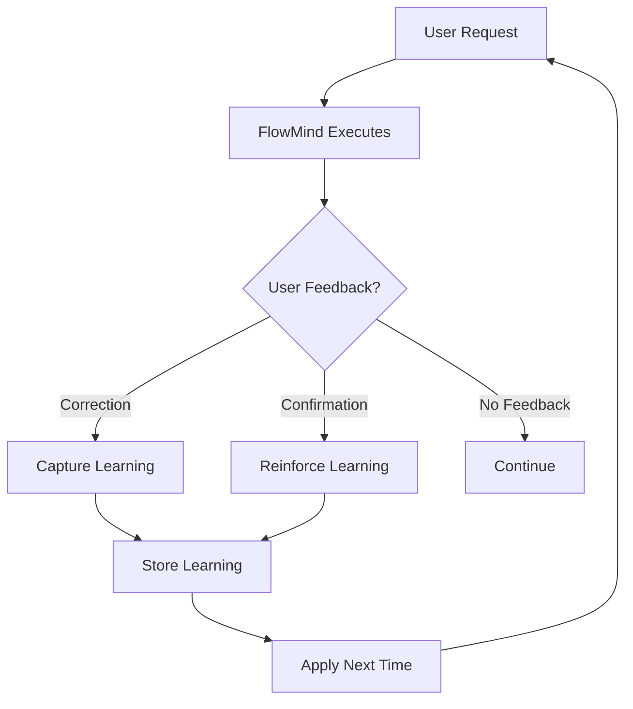

<![CDATA[---
name: learning-engine
description: Core learning engine that powers FlowMind's ability to learn from user corrections and preferences. This is the heart of FlowMind's intelligence.
metadata:
  version: "1.0.0"
  author: flowmind
  category: core
  priority: highest
---

# FlowMind Learning Engine

The core intelligence that makes FlowMind learn and adapt to your workflow.

## How Learning Works

### The Learning Loop



### Learning Types

| Type | Trigger | Example |
|------|---------|---------|
| **Correction** | User corrects output | "不对，用表格格式" |
| **Refinement** | User improves process | "先查错误再查链路" |
| **Preference** | User specifies style | "用中文回复" |
| **Scene Mapping** | User defines workflow | "这类需求走xxx流程" |

## Learning Storage

### Directory Structure

```
~/.flowmind/learning/
├── records/                    # Learning records by skill
│   ├── log-audit/
│   │   ├── 2026-06-22-001.json
│   │   └── 2026-06-22-002.json
│   ├── code-review/
│   └── _global/
├── scenes.json                # Scene-skill mappings
├── skill-bindings.json        # Skill learning bindings
└── stats.json                 # Learning statistics
```

### Learning Record Format

```json
{
  "id": "learn-20260622-001",
  "timestamp": "2026-06-22T10:30:00Z",
  "skill": "log-audit",
  "type": "output_format",
  "severity": "major",
  "context": {
    "userRequest": "查询 traceId 日志",
    "executionContext": "Log audit skill execution"
  },
  "correction": {
    "original": "Tree format output",
    "corrected": "Sequential list format",
    "reason": "User prefers chronological view"
  },
  "application": {
    "condition": "When outputting trace results",
    "action": "Use sequential list format",
    "priority": "high"
  },
  "verification": {
    "verified": true,
    "verifiedAt": "2026-06-22T10:31:00Z"
  },
  "stats": {
    "appliedCount": 5,
    "successCount": 5
  }
}
```

### Scene Mapping Format

```json
{
  "version": "1.0",
  "mappings": [
    {
      "id": "scene-001",
      "name": "Trace Log Query",
      "keywords": ["traceId", "日志", "链路", "trace"],
      "patterns": [
        "查询.*traceId.*日志",
        "查看.*链路"
      ],
      "workflow": {
        "skills": ["log-audit"],
        "params": {
          "format": "sequential-list",
          "includeRequest": true,
          "includeResponse": true
        }
      },
      "preferences": {
        "outputFormat": "sequential-list",
        "language": "zh-CN"
      },
      "stats": {
        "useCount": 10,
        "lastUsed": "2026-06-22T15:00:00Z",
        "successRate": 1.0
      }
    }
  ]
}
```

## Learning Process

### Step 1: Detect Learning Opportunity

```javascript
function detectLearning(input, context) {
  // Check for correction patterns
  if (isCorrectionPattern(input)) {
    return { type: 'correction', ... };
  }

  // Check for scene mapping patterns
  if (isSceneMappingPattern(input)) {
    return { type: 'scene_mapping', ... };
  }

  // Check for preference patterns
  if (isPreferencePattern(input)) {
    return { type: 'preference', ... };
  }

  return null;
}
```

### Step 2: Capture Context

```javascript
function captureContext(userRequest, executionResult) {
  return {
    userRequest: userRequest,
    executionContext: executionResult.context,
    timestamp: new Date().toISOString(),
    skill: executionResult.skill
  };
}
```

### Step 3: Create Learning Record

```javascript
function createLearningRecord(context, correction) {
  const record = {
    id: generateId(),
    timestamp: new Date().toISOString(),
    skill: context.skill,
    type: correction.type,
    context: context,
    correction: correction,
    application: generateApplicationRule(correction)
  };

  return saveLearningRecord(record);
}
```

### Step 4: Update Bindings

```javascript
function updateSkillBindings(skill, record) {
  const bindings = loadSkillBindings();

  if (!bindings[skill]) {
    bindings[skill] = { records: [], rules: [] };
  }

  bindings[skill].records.push(record.id);
  bindings[skill].rules.push(record.application);

  saveSkillBindings(bindings);
}
```

## Knowledge Application

### Pre-Execution Check

Before executing any task:

```javascript
async function executeWithLearning(request, context) {
  // 1. Check scene mappings
  const sceneMatch = matchScene(request);
  if (sceneMatch && sceneMatch.confidence >= 0.7) {
    return applySceneWorkflow(sceneMatch, request);
  }

  // 2. Check skill learning bindings
  const skill = selectSkill(request);
  const learnings = getSkillLearnings(skill);

  // 3. Apply learnings
  let result = await executeSkill(skill, request, context);
  result = applyLearnings(result, learnings);

  return result;
}
```

### Matching Algorithm

```javascript
function matchScene(request) {
  const scenes = loadScenes();
  let bestMatch = null;
  let bestScore = 0;

  for (const scene of scenes) {
    const score = calculateMatchScore(request, scene);
    if (score > bestScore) {
      bestScore = score;
      bestMatch = scene;
    }
  }

  return bestScore >= 0.7 ? bestMatch : null;
}

function calculateMatchScore(request, scene) {
  const keywordScore = matchKeywords(request, scene.keywords) * 0.4;
  const patternScore = matchPatterns(request, scene.patterns) * 0.3;
  const historyScore = (scene.stats.useCount / 100) * 0.2;
  const confidenceScore = scene.stats.successRate * 0.1;

  return keywordScore + patternScore + historyScore + confidenceScore;
}
```

## User Confirmation

When learning is captured:

```
┌─────────────────────────────────────────────────────┐
│ 🧠 Learning Captured                                │
├─────────────────────────────────────────────────────┤
│ ID: learn-20260622-001                              │
│ Skill: log-audit                                    │
│ Type: output_format                                 │
├─────────────────────────────────────────────────────┤
│ Your preference has been recorded.                  │
│ FlowMind will apply this automatically next time.   │
└─────────────────────────────────────────────────────┘
```

When learning is applied:

```
┌─────────────────────────────────────────────────────┐
│ ✨ Applying Learned Workflow                        │
├─────────────────────────────────────────────────────┤
│ Based on: learn-20260622-001                        │
│ Applied: 5 times                                    │
│ Success rate: 100%                                  │
├─────────────────────────────────────────────────────┤
│ Using your preferred: sequential list format        │
└─────────────────────────────────────────────────────┘
```

## Management Commands

### View Learnings

```bash
flowmind learn list [--skill <name>] [--type <type>]
```

### View Scenes

```bash
flowmind scenes list
```

### Delete Learning

```bash
flowmind learn delete <id>
```

### Reset Skill

```bash
flowmind learn reset <skill>
```

### Export/Import

```bash
flowmind learn export [--output <file>]
flowmind learn import <file>
```

## Privacy & Security

- **Local Only**: All learning data stored locally
- **No Cloud**: Nothing sent to external servers
- **User Control**: Full control over all data
- **Encryption**: Optional encryption for sensitive data

## Best Practices

1. **Be Specific**: More specific corrections = better learning
2. **Confirm Patterns**: Verify learned patterns are correct
3. **Review Regularly**: Check and clean old learnings
4. **Share Knowledge**: Export and share with team

## Troubleshooting

### Learning Not Applying

1. Check if learning exists: `flowmind learn list`
2. Verify confidence threshold in config
3. Check skill bindings

### Wrong Behavior

1. Review scene mappings: `flowmind scenes list`
2. Check learning records
3. Reset if needed: `flowmind learn reset <skill>`

### Performance Issues

1. Limit learning records per skill
2. Archive old learnings
3. Clean up unused scenes
]]>